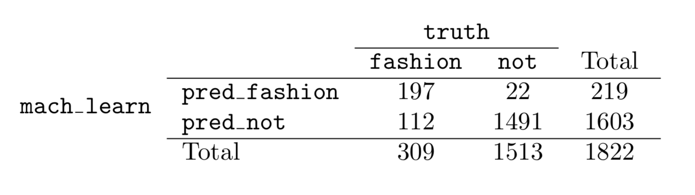
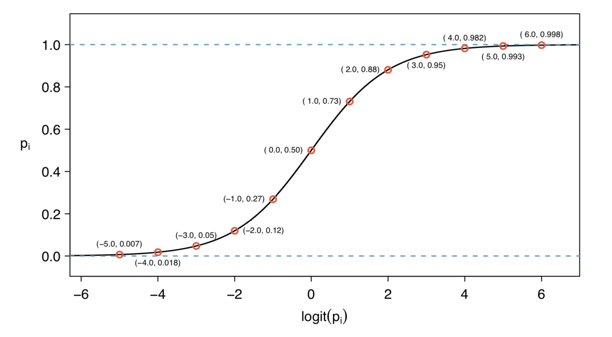

```{r setup, include=FALSE}
options(htmltools.dir.version = FALSE)
knitr::opts_chunk$set(fig.align="center", fig.width=5, fig.height=5, warning = FALSE, message = FALSE)
```

```{r xaringan-themer, include = FALSE}
library(xaringanthemer)
mono_accent(
  base_color = "black",
  #secondary_color = "",
  header_font_google = google_font("Roboto", "400"),
  text_font_google   = google_font("Lato", "300"),
  code_font_family = "Fira Code",
  code_font_url = "https://cdn.rawgit.com/tonsky/FiraCode/1.204/distr/fira_code.css",
  header_color = "#f54278",
  title_slide_background_color = "ivory",
  title_slide_text_color = "#354a66",
  table_row_even_background_color = "white"
)
```

---
### What are classification problems?

**classification**: supervised learning task with the goal of assigning an individual to one of a known set of groups

--

**binary classification**: classification problem in which there are two possible groups 


---
### Confusion Matrix 

#### (yes, we really call it the confusion matrix)

Given a list of prediction results for a supervised binary classification we can use the confusion matrix to appraise model performance.

 <style> 

tr.bordered {
    border-bottom: solid
}
  </style> 
  
<style>  
 td{ border-left:1px solid #ccc; border-right: 1px solid #ccc;}
tr.bordered {
    border-bottom: 1px solid #ccc;
}
</style>


<table>
<thead><tr><td></td><td colspan = 2 align = "center"><b>Reality</b></td></tr>
<tr class = "bordered"><td><b>Prediction</b></td><td align = "center">True</td><td align="center">False</td></tr></thead>


<tr><td>True</td><td>True Positive</td><td>False Positive</td></tr>
<tr><td>False</td><td>False Negative</td><td>True Negative</td></tr>
</table>

--

  There are many different metrics used to appraise model performance.


---
### False Positive Rate

What fraction of negatives are incorrectly classified (as positives):

`$$ \mbox{FPR} = \frac{\mbox{FP}}{\mbox{FP+TN}} $$`


--
### False Negative Rate

What fraction of positives are incorrectly classified (as negatives):

`$$ \mbox{FNR} = \frac{\mbox{FN}}{\mbox{FN+TP}} $$`

--

Typically there is a tradeoff between these measures.

---
### True Positive Rate aka Sensitivity aka Recall

What fraction of positives are classified correctly:

`$$ \mbox{TPR or Sensitivity} = \frac{\mbox{TP}}{\mbox{TP+FN}} $$`

--
### True Negative Rate aka Specificity

What fraction of negatives are classified correctly:

`$$ \mbox{TNR or Specificity} = \frac{\mbox{TN}}{\mbox{TN+FP}} $$`


---
### Precision or Positive Predictive Value

Can you trust a positive result?

`$$ \mbox{PPV (Precision)} = \frac{\mbox{TP}}{\mbox{TP+FP}} $$`

--
### Negative Predictive Value

Can you trust a negative result? 

`$$ \mbox{NPV } = \frac{\mbox{TN}}{\mbox{TN+FN}} $$`

---
### Question: Calculating metrics for a given problem

A machine learning model was trained to detect if photos were fashion-related or not. The results of using the model with a test data set are shown below. 

--

What are the **FPR**, **FNR**, **TPR**,  **TNR**, **PPV**, and **NPV**? 

```{r echo = FALSE}

```

---
### Answers

`$$ \mbox{FPR} = \frac{22}{1513} = .015  $$`
`$$ \mbox{FNR} = \frac{112}{309} = .362  $$`
`$$ \mbox{TPR} = \frac{197 }{309} = .638  $$`
`$$ \mbox{TNR} = \frac{1491}{1513} = .985  $$`
`$$ \mbox{PPV} = \frac{197}{219} =  .900 $$`
`$$ \mbox{NPV} = \frac{1491}{1603} = .930  $$`


---
### Logistic regression 

One example of Generalised Linear Modeling, specifically we are looking for a model of the form

`$$ \mbox{ln} \left( \frac{p}{1-p}  \right) = b_o + b_1 x_1 + \ldots + b_n\ldots x_n$$`

p: probability of the event happening

$\mbox{ln}\left(\frac{p}{1-p}\right)$ is sometimes referred to as the **logit** function


---
### What does the logit function look like?

```{r echo = FALSE}

```


---
### Interpreting the coefficients

  * In a general sense, the coefficients in a logistic regression model are interpreted in the same manner as for a multiple regression model
  
  * However they indicate how much the **logit(p)** changes in response to changes in the explanatory variable
  
  
--
### Making predictions

  * We often set a threshold probability above which we take predicted values to indicate a prediction that the event will happen
  
  

---
### Model Selection 

  * Just as in linear regression we can use the AIC (or other measures) to do backward or forward selection
  
  * in R, we use <tt>glm</tt> to build logistic regression models, and <tt>step</tt> to do stepwise selection
  
