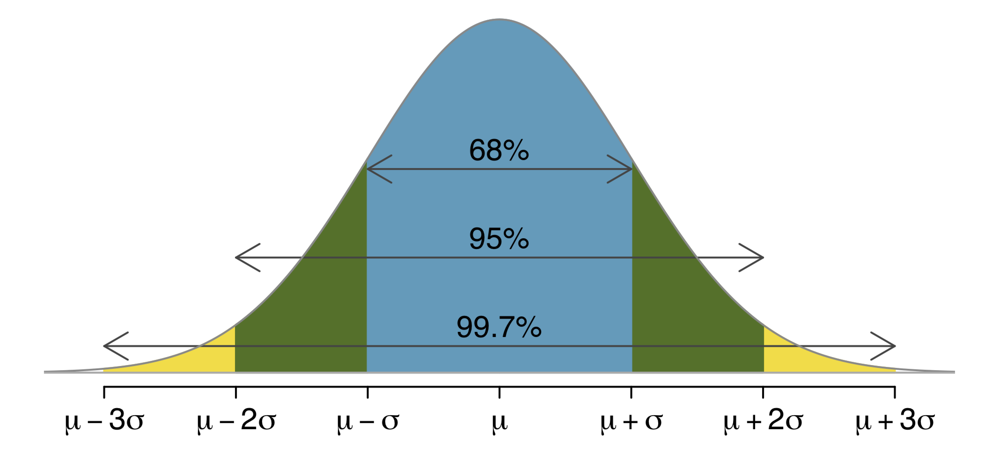

```{r setup, include=FALSE}
options(htmltools.dir.version = FALSE)
knitr::opts_chunk$set(fig.align="center", fig.width=5, fig.height=5, 
                      warning = FALSE, message = FALSE, fig.align="center")
library(tibble)
library(DT)

check <- "✅" 
cross <- "❌"


```

```{r xaringan-themer, include = FALSE}
library(xaringanthemer)
mono_accent(base_color = "grey",
  header_font_google = google_font("Roboto", "400"),
  text_font_google   = google_font("Lato", "300"),
  code_font_family = "Fira Code",
  header_color = "#f54278",
  code_font_url = "https://cdn.rawgit.com/tonsky/FiraCode/1.204/distr/fira_code.css")
```


---
### Probability Distributions

Some Discrete Probability Distributions we will look at:

  * Geometric 
  
  * Binomial 
  
A continuous distribution we will look at:

  * Normal Distribution


---
### Background: Bernoulli Random Variable

  
  * Single trial with two outcomes
      * often considered *success* or *failure*
      
  * parameter: Probability of success 
  

---
### Classic Example: Tossing a fair coin


`$$p = 0.5$$`


---
### Some common questions

  * How many trials before first success?
    * use geometric distribution
  
  * How many successes from a set number of trials?
    * use binomial distribution
   
  
  
  
---
### Geometric Distribution

Consider:
  * A machine makes a part with a 3% defective rate
  * Each part produced is independent of the other
  
How long until the first defective part is manufactured?

---
## Let's consider some scenarios

--
#### The 1st part manufactured might be defective
--
`$$P(X = 1) = .02$$`

--
#### Or ... 1st works well; 2nd is defective
--
`$$\implies P(X = 2) = 0.98 × .02  = .0196$$`


--
#### Or ... 1st works well; 2nd works well; 3rd is defective 
--
`$$\implies P(X = 3) = 0.98 ×0.98 ×.02 = .019208$$`
--

#### Is there a general formula?
--
`$$P(X = k) = (0.98)^{k-1} ×.02$$`


---
### Geometric Distribution

`$$P(X = k) = (1 - p)^{k-1} × p $$`


---
### What does the distribution look like?

* Event potentially happen at the very first trial

* Or ... we could theoretically be waiting forever for it to happen


---
### First, we create a function 

I know, this may be your first function. 
--
```{r}
prob <- function(k, p){
  ((1 - p)^(k-1))*p
}
```

#### Ok, let's try some values
--
```{r}
prob(1, .02)
```
--
```{r}
prob(2, .02)
```
--
```{r}
prob(3, .02)
```


---
```{r out.width = "70%"}
range <- 1:10
barplot(purrr::map_dbl(range, prob, p = .02), names.arg = range, ylab = "P(X = k)", las = 1)
```

---
### Another geometric distribution problem

On a particular production line, the probability that an item is faulty is 0.08. In a quality control test, items are selected at random from the production line. It is assumed that the quality of an item is independent of that of other items.

Find the probability that the first faulty item:
  * does not occur in the first six selected
  
  * occurs in fewer than four selections


---
### Binomial distribution 


 * Fixed number of trials, n

 * known probability of success, p for each event
 

We say 
`$$ X \sim B(n, p)$$`

```{r echo = FALSE}

T01 <- cross
T02 <- cross
T03 <- cross
T04 <- cross

table0 <- tibble(`Trial 1` = T01,`Trial 2` = T02,`Trial 3` =  T03, `Trial 4` = T04)


T11 <- c(check, cross, cross, cross)
T12 <- c(cross, check, cross, cross)
T13 <- c(cross, cross, check, cross)
T14 <- c(cross, cross, cross, check)

table1 <- tibble(`Trial 1` = T11,`Trial 2` = T12,`Trial 3` =  T13, `Trial 4` = T14)


T21 <- c(check, check, check, cross, cross, cross)
T22 <- c(check, cross, cross, check, check, cross)
T23 <- c(cross, check, cross, check, cross, check)
T24 <- c(cross, cross, check, cross, check, check)

table2 <- tibble(`Trial 1` = T21,`Trial 2` = T22,`Trial 3` =  T23, `Trial 4` = T24)

T31 <- ifelse(T14 == cross, check, cross)
T32 <- ifelse(T13 == cross, check, cross)
T33 <- ifelse(T12 == cross, check, cross)
T34 <- ifelse(T11 == cross, check, cross)

table3 <- tibble(`Trial 1` = T31,`Trial 2` = T32,`Trial 3` =  T33, `Trial 4` = T34)

T41 <- check
T42 <- check
T43 <- check
T44 <- check

table4 <- tibble(`Trial 1` = T41,`Trial 2` = T42,`Trial 3` =  T43, `Trial 4` = T44)

```

---
### 

* **Trial scenario**: performing 4 trials each of which has probability of success, p.

* there are 5 possible outcomes. What is the probability of each?

`$$P(X = 0) = ?$$`

`$$P(X = 0) = ?$$`

`$$P(X = 0) = ?$$`

`$$P(X = 0) = ?$$`

`$$P(X = 0) = ?$$`


---
### Trying to arrive at the formula

To start: only 1 way to get 0 successes from 4 trials:
```{r echo = FALSE}
datatable(table0,  class = 'cell-border stripe', options = list(dom = 't'))
```


And what is the probability of this event?
--

`$$P(❌❌❌❌) =(1-p)\cdot(1-p)\cdot(1-p)\cdot(1-p) = (1-p)^4$$`


--

Similarly, only one way to have 4 successes from 4 trials:
--
```{r echo = FALSE}
datatable(table4,  class = 'cell-border stripe', options = list(dom = 't'))
```
--

And the probability of this event is: 
`$$P(✅✅✅✅)=p\cdot p \cdot p \cdot p =p^4$$`


---
### What about other values of X?

  * We want a general formula to calculate:
  `$$P(X = 1) = ?$$`
  `$$P(X = 2) = ?$$`
  `$$P(X = 3) = ?$$`
  
  


---
### What is P(X = 1) if n = 4?

--
`$$P(✅ ❌❌❌) =p\cdot(1-p)\cdot(1-p)\cdot(1-p)=p\cdot(1-p)^3$$`
--
`$$P(❌✅ ❌ ❌ )=(1-p)\cdot p \cdot (1-p)\cdot (1-p)=p\cdot(1-p)^3$$`
--
`$$P(❌ ❌ ✅ ❌)=(1-p)\cdot(1-p)\cdot p \cdot (1-p)= p \cdot(1-p)^3$$`
--
`$$P(❌ ❌ ❌ ✅ )=(1-p)\cdot(1-p)\cdot(1-p)\cdot p = p\cdot(1-p)^3$$`
--
`$$\implies P(X = 1) = {4 \choose 1}\cdot p \cdot (1-p)^3$$`


---
#### What is P(X = 2)?
--
`$$P(✅✅❌❌) = p\cdot p \cdot(1-p)\cdot(1-p)= p^2\cdot(1-p)^2$$`
--
`$$P(✅ ❌ ✅ ❌ ) = p\cdot(1-p)\cdot p \cdot (1-p) = p^2\cdot(1-p)^2$$`
--
`$$P(✅ ❌ ❌✅) = p\cdot(1-p)\cdot(1-p)\cdot p =p^2\cdot(1-p)^2$$`
--
`$$P(❌✅ ✅ ❌) = (1-p)\cdot p\cdot p\cdot (1-p)=p^2\cdot(1-p)^2$$`
--
`$$P(❌✅ ❌✅ ) = (1-p) \cdot p \cdot (1-p) \cdot p =p^2\cdot(1-p)^2$$`
--
`$$P(❌❌✅ ✅ ) = (1 - p)\cdot(1-p)\cdot  p\cdot p = p^2 \cdot(1-p)^2$$`


--
`$$\implies P(X = 2) = {4 \choose 2}\cdot p^{2} \cdot (1-p)^2$$`


---
### General Formula?

`$$\implies P(X = k) = {4 \choose k}\cdot p^{k} \cdot (1-p)^{4 -k}$$`

--
Does this work for X = 3?


---
### How many ways to have 3 successes in 4 trials?

```{r echo = FALSE}
datatable(table3,  class = 'cell-border stripe', options = list(dom = 't'))
```


**Will our previous formula work?**
--

Yes.
`$$ P(X = 3) = {4 \choose 3}\cdot p^{3} \cdot (1-p)^{4 -3}$$`


---
### What does the pmf of a binomial distribution look like?

What shape would you expect if:
--

  * p is close to 0
  
--
  
  * p is close 0.5
  
--

  * p is close to 1
  


---
### The normal distribution


  * continuous 
  
  * symmetric
  
  * unimodal 
  
  * bell-shaped
  
  * a family of distributions with different means and standard deviations 
  
  

---
### Valuable Heuristics

  * 68.2% of values lie within 1 standard deviation of the mean
  
  * 95% within 2 standard deviations of the mean

  * 99.7% within 3 standards deviations of the mean
  
  
---
### 68-95-99 Rule illustrated 

```{r echo = FALSE}

```


---
### Notation

When a random variable X is generated from a normal distribution we use the notation:

`$$ X \sim N(\mu. \sigma) $$`

---
### Standard normal distribution

In statistics, one particular normal distribution gets a lot of attention, the **standard normal** distribution.

  * `$$\mu = 0$$`
  
  
  
  * `$$\sigma = 1 $$`

---
### R functions for working with normal distributions

  * <tt>pnorm</tt>: the cdf of a normal distribution
  
  
  * <tt>qnorm</tt>: Gives the probability that a normally distributed variable is less (or greater) than a given value 
  


---
### Using pnorm with a standard normal distribution

#### How much of the distribution is less than 0?

```{r}
pnorm(0)
```

#### How much of the distribution is less than 1.645?

```{r}
pnorm(1.645)
```


#### How much of the distribution is greater than 1.96
```{r}
pnorm(1.96, lower.tail = FALSE)
```


---
### What about other normal distributions?

For other normal distributions we can use <tt>pnorm</tt> while specifying the mean and standard deviation.

Suppose the diameter of a certain car component follows the normal distribution with
X ∼ N(10, 3). Find the proportion of these components that have diameter larger
than 13.4 mm. Or, if we randomly select one of these components, find the probability
that its diameter will be larger than 13.4 mm.

Method 1: 
```{r}
pnorm(13.4, mean = 10, sd = 3, lower.tail = FALSE)
```


---
### Z scores

  * Sometimes - on an exam for instance - one does not have a computer. 

  * values from any normal distribution can be converted to values from a standard normal using the formula:


`$$ z = \frac{X - \mu}{\sigma} $$`


The z-score value is the same number of standard deviations away from the mean in the standard normal as the original value was in its own normal distribution  


---
### Solving previous problem using z scores

Method 2: Using the standard normal distribution

`$$ z = \frac{13.4 - 10}{3} $$`

```{r}
pnorm(3.4/3, lower.tail = FALSE)
```


---
### Using qnorm to solve the inverse problem

  * <tt>qnorm</tt> on the other hand, gives the inverse of the <tt>pnorm</tt>
  
  * qnorm returns the quantile value for a given fraction between 0 and 1
  
  
---
### Example using qnorm

The heights of students at a particular school are normally distributed with mean of 169 cm and standard deviation of 9 cm. 

  * Given that 80% of students have a height less than _h_ cm, find the value of _h_
  
--
```{r}
qnorm(0.8, mean = 169, sd = 9)
```

--
  * Given that 60% of students have a height greater than _s_ cm, find the value of _s_
  
--
```{r}
qnorm(0.6, mean = 169, sd = 9, lower.tail = FALSE)
```
--

**Or:**

```{r}
qnorm(0.4, mean = 169, sd = 9)
```


---
### Now to use Z scores with the paper tables
