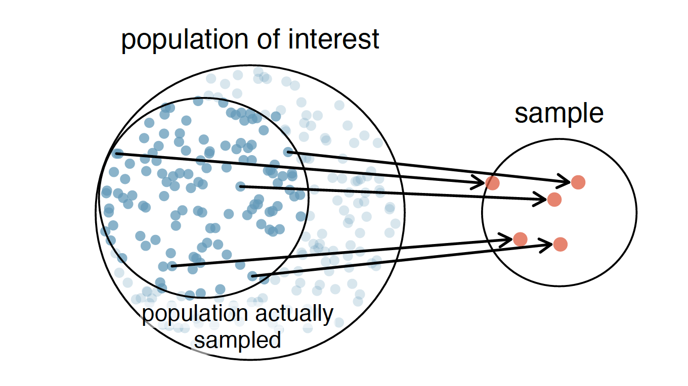

```{r setup, include=FALSE}
options(htmltools.dir.version = FALSE)
knitr::opts_chunk$set(fig.align="center", fig.width=5, fig.height=5, warning = FALSE, message = FALSE)
```

```{r xaringan-themer, include = FALSE}
library(xaringanthemer)
duo_accent(
  primary_color = "ivory",
  secondary_color = "#310A31",
  header_font_google = google_font("Roboto", "400"),
  text_font_google   = google_font("Lato", "300"),
  code_font_family = "Fira Code",
  code_font_url = "https://cdn.rawgit.com/tonsky/FiraCode/1.204/distr/fira_code.css",
  header_color = "#f54278",
  title_slide_text_color = "#354a66"
)
```

### Statistical Inference

#### inference: reasoning about the population based on data collected from a sample 

---
### Relationship between sample and population


```{r echo=FALSE}

```


---
### Parameters and sample statistics

  * parameters are characteristics of the population that we want in ideally
    * e.g. mean, proportion with a specified characteristic
    
  * sample statistics are things we can measure or calculate in the sample population
  
  * typically, for each parameter there's an accompanying sample statistic


---
### How do population parameters and sample statistics differ?

Consider a population: 

`$$\mu \mbox{, the mean of the entire population (parameter)}$$`


`$$\bar{x} \mbox{, the mean of a sample (sample statistic)}$$`


How do the two quantities compare?
  
  * What effect does sample size have?
  
  * What effect does the variability in the population have?


---
### First type of inference: Point Estimate for the mean


For the mean of a single population:
  * the sample mean is the best estimate we can come up with
  
  * there is a question of how confident we can be in this estimate


---
### Central Limit Theorem

Under a large variety of circumstances: 

`$$ X \sim N(\mu, \sigma) $$`

`$$ \implies \bar{X} \sim N\left(\mu, \frac{\sigma}{\sqrt{n}}\right) $$`


---
### Brief pause for some terminology


  * The distribution of the sample statistic is known as the **sampling distribution**
  
  * the standard deviation of the sampling distribution is known as the **standard error**


---
### When can we use the CLT?

Conditions necessary for the Central Limit theorem to hold:

  * the sample must be random
  
  * the sample should be less than 10% of the population 
  
  * either:
  
    * the underlying distribution is normal
  
    * the sample size is sufficiently large (typically > 30)
  

---
### How does that actually help us?


  * the sample mean is the best estimate we can come up with for the population mean
  
--

  * the sample mean is almost certainly wrong though
  
--

  * Can the CLT help us out?


---
### Confidence Interval for mean 

  
  * We can use the CLT to form a confidence interval
  
--

  * What is a confidence interval?

--
  
    * a plausible range of values for the mean
    
  
---
### CI if CLT holds


  * if the CLT holds, we know that the sample mean will be within 1.96 standard errors of the true mean 95% of the time

--
  
  * conversely, the true (population) mean will be within 1.96 standard errors of the sample mean, 95% of the time.
  
  
--

  * therefore we can construct an interval centered around the sample mean that would plausibly contain the true (population) mean
  
  
  
---
### But we have a problem

  * to form the interval we need the standard error
  
--

  * so we have to use our best estimate: we use the sample sd, _s_ in lieu of the population standard deviation 
  
--

  `$$ \mbox{95% CI:    }  \bar{x} \pm 1.96 \frac{s}{\sqrt{n}}$$`
  


---
### What about other confidence intervals?

  * what multiplier should we use for a 90% confidence interval?
  
--

  * a multiplier of 1.5 corresponds to what confidence interval? 


---
### And what if the CLT does not hold?

Well ... there's the t-distribution(s).


```{r echo=FALSE}

```

  * confidence intervals will be wider than those that we get using multipliers from the normal distribution.

---
### Using the t-distribution

If conditions are not met for using the multipliers from the normal distribution

`$$ CI = \bar{x} \pm {t^{*}}_{df} $$`
`$$ df = n - 1 $$`


