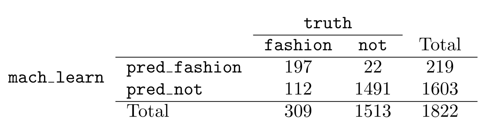

```{r setup, include=FALSE}
options(htmltools.dir.version = FALSE)
knitr::opts_chunk$set(fig.align="center", fig.width=5, fig.height=5, warning = FALSE, message = FALSE)
```

```{r xaringan-themer, include = FALSE}
library(xaringanthemer)
duo_accent(
  primary_color = "ivory",
  secondary_color = "#310A31",
  header_font_google = google_font("Roboto", "400"),
  text_font_google   = google_font("Lato", "300"),
  code_font_family = "Fira Code",
  code_font_url = "https://cdn.rawgit.com/tonsky/FiraCode/1.204/distr/fira_code.css",
  header_color = "#f54278",
  title_slide_text_color = "#354a66"
)
```
<script src="//yihui.name/js/math-code.js"></script>
<!-- Just one possible MathJax CDN below. You may use others. -->
<script async
  src="//mathjax.rstudio.com/latest/MathJax.js?config=TeX-MML-AM_CHTML">
</script>
### Random processes

A random process:
  * an experiment with more than one possible outcome
  * the set of possible **outcomes** is known
  
An outcome the observed result of the experiment 

An event is a subset of the outcome space. 


---
### Example of Random Process

Experiment: throwing a die

Outcome: the number on the top-facing side of the die

Examples of events:
  * number rolled is 3
  * number rolled is even
  * number rolled is not 5
  * number rolled is less than 4
  
Note: the event can be comprised of more than one element of the outcome space.


---
### Defining probability 


The probability of an outcome is the proportion of times the outcome would occur if we observed the random process an infinite number of times.


---
### Notation

Probability of A
--


`$$P(\mbox{A})$$`


--


Probability of at least one of A and B


--


`$$P(A\ \mbox{or}\ B)$$` 


--


Probability of both events, A and B, happening

--


`$$P(A\ \mbox{and}\ B)$$` 


---
### Rule of Probability


`$$0 \leq P(A) \leq 1$$`


---
### Disjoint outcomes or events


Disjoint outcomes or events are events that cannot take place simultaneously, e.g:

  * 2 dice are thrown:
    * **A**: the sum is less than or equal to 3
    * **B**: the sum is greater than 5 

--
  
  * A card is drawn from a pack of playing cards:
    * A face card is selected 
    * A non face card is selected
  
--

Disjoint events are also said to be **mutually exclusive** 

---
### Addition rule for disjoint events

`$$P (A\ \mbox{or}\ B) = P (A) + P (B)$$` 


---
### Example: using the addition rule for disjoint events

In the loans data set (10,000 rows), the \textit{homeownership} variable had 3 values:
  
  * <tt>rent</tt>: 3,858 applicants
  * <tt>mortgage</tt>: 4,789 applicants
  * <tt>own</tt>: 1,353 applicants
  
--

What is the probability that the applicant either rents or owns their home?

--

Answer: 
`$$\frac{3858 + 1353}{10000} = 0.5211 $$`


---
### General Addition Rule

A more general addition rule is necessary if events are not disjoint:
--

`$$P (A\ \mbox{or}\ B) = P (A) + P (B) − P (A\ \mbox{and}\ B)$$`


---
### Example: Loans

What is the probability that an application from the loans data set was either:
  * a joint application
  * for a mortgage
  
A: joint application
B: loan purpose is the purchase of a house

`$$P (A\ \mbox{or}\ B) = P (A) + P (B) − P (A\ \mbox{and}\  B)$$`


---

```{r message=FALSE}
library(readr)
loans <- read_csv("data/Loans.csv")
addmargins(table(loans$loan_purpose, loans$app_type))
```


---

`$$P(A) = \frac{1495}{10000}$$`

--

`$$P(B) = \frac{151}{10000}$$`


--
`$$P(A\ \mbox{and}\ B) = \frac{5}{10000}$$` 

--

`$$P(A\ \mbox{or}\ B) = \frac{1495 + 151 - 5}{10000} = .1641$$`


---
### Independent Events

* Events are said to be independ   ent when the outcome of one does not affect the outcome of the other. 

* E.g. when two dice are thrown the result of one does not affect the probability of the other

* Independent and disjoint do not mean the same thing. 


---
### Multiplication Rule for Independent Events

`$$P(A\  \mbox{and}\ B) = P(A) × P(B)$$` 

--

A fair die is thrown twice. Find the probability that two fives are thrown.


---
### Multiplication rule: Example 2

The probability that a certain type of machine will break down in the first month of operation is 0.1. If a firm has installed two such machines:

  * What is the probability that just one has broken down?
  
  * What is the probability that both have broken down?
  
  * What is the probability that neither has broken down?


---
### Conditional Probability 

When events are not independent, the occurrence of one changes the probability of the other.

`$$P(A\  \mbox{and}\ B) \neq P(A) × P(B)$$` 

`$$P(A  \mbox{and}\ B) = P(A|B) × P(B)$$`


---
### Marginal and Joint Probability

  * **marginal** probability: based on a single variable
  
--


  * **joint** probability: based on outcomes for two or more variables or processes 


---
### Conditional Probability: Example

Photo predictor results:

```{r echo=FALSE}

```

  * What is the probability the algorithm is incorrect if it is known that the photo is about fashion?
  
  * What is the probability that the photo is about fashion if the algorithm says it is?
  
  * What is the probability that the photo is about fashion if the algorithm says it is not?


---
## Multiplication rule for conditional probability 


`$$P(A|B) = \frac{P(A\ \mbox{and}\ B)} {P(B)}$$`


---
### Probability Distributions

  * A function that gives the probability of an outcome for each possible outcome of a random process.
  
--

  * For a discrete random variable, the distribution may be in the form of a list/table:
    * each possible value is associated with the probability of occurrence
    
--
  
  * For a continuous random variable, the distribution typically is expressed as a mathematical function
  

---
### Example of a distribution of a discrete random variable

Consider the sum of two scores of two thrown dice:
  * possible values between 2 and 12 
  * 36 possible combinations:
    * 1 combination sums to 2
    * 2 combinations sum to 3
    * 3 combinations sum to 4
    * 4 combinations sum to 5
    * 5 combinations sum to 6
    * 6 combinations sum to 7
    * 5 combinations sum to 8
    * 4 combinations sum to 9 
    * 3 combinations sum to 10
    * 2 combinations sum to 11
    * 1 combination sums to 12


---
### 


X | 2 | 3 | 4 | 5 | 6 | 7 | 8 | 9 | 10 | 11 | 12
--|--|--|--|--|--|--|--|--|--|--|--|--|
P(X) | `$$\frac{1}{12}$$` | `$$\frac{2}{12}$$` | `$$\frac{3}{12}$$` | `$$\frac{4}{12}$$` | `$$\frac{5}{12}$$` | `$$\frac{6}{12}$$` | `$$\frac{5}{12}$$` | `$$\frac{4}{12}$$` | `$$\frac{3}{12}$$` | `$$\frac{2}{12}$$` | `$$\frac{1}{12}$$`


---
### Common Discrete Probability Distributions

  * Geometric Distribution: time until first success with independent trials
  
--

  * Binomial Distribution: probability of *k* successes from independent trials
  


