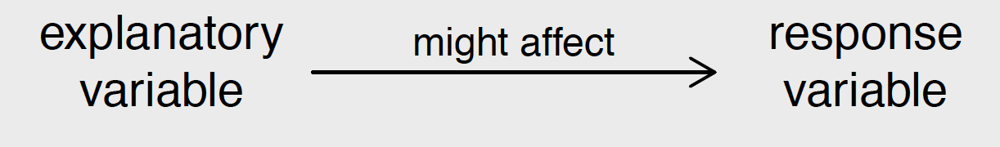
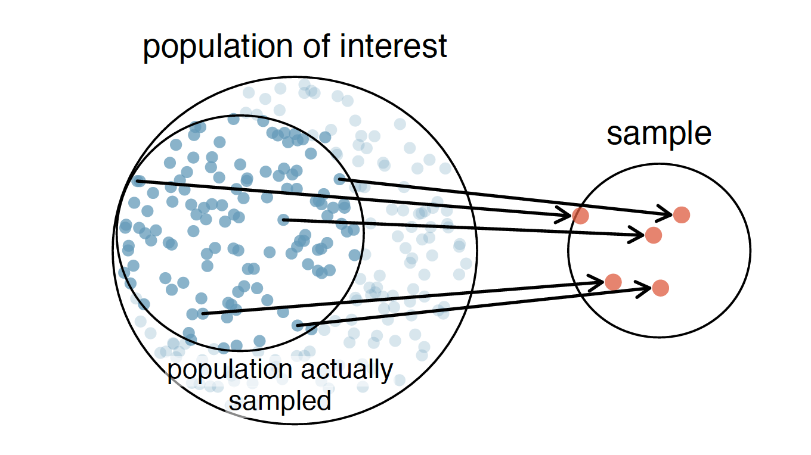
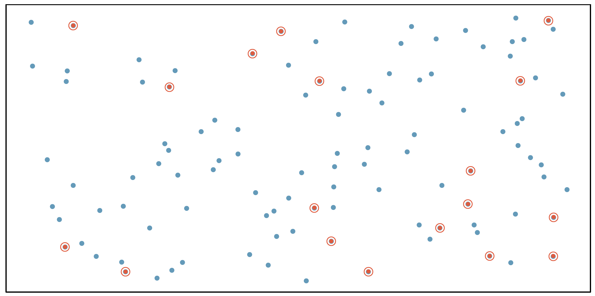
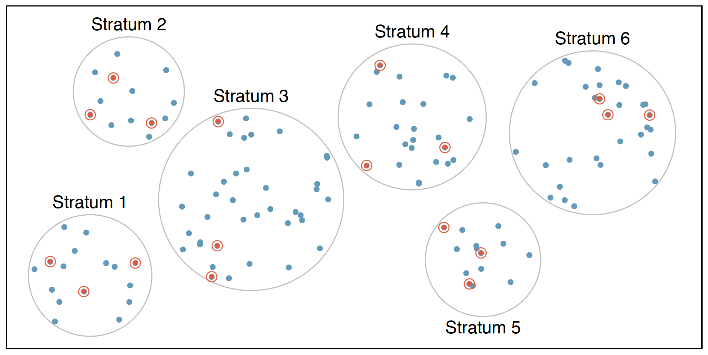
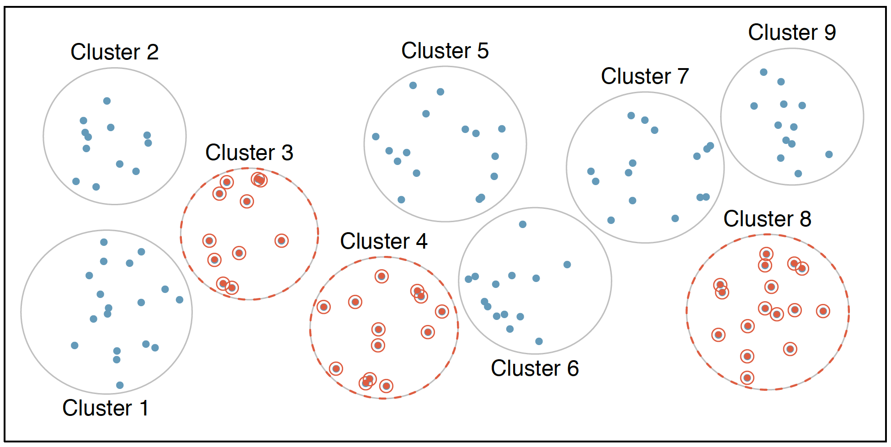
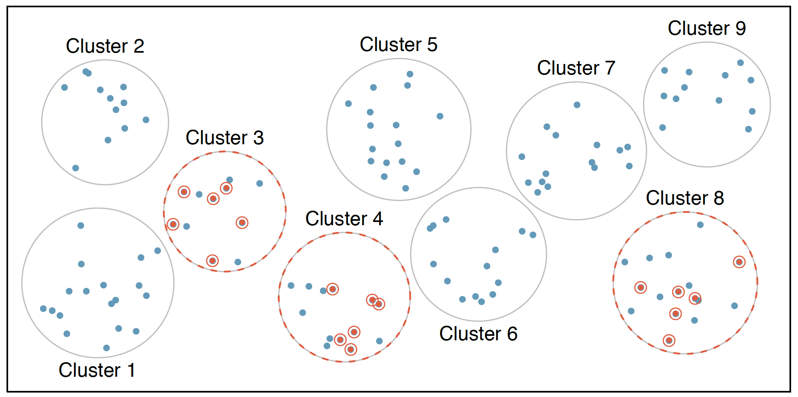

```{r setup, include=FALSE}
options(htmltools.dir.version = FALSE)
library(tidyverse)
library(sf)

knitr::opts_chunk$set(fig.align="center", fig.width=5, fig.height=5, warning = FALSE, message = FALSE)
```

```{r xaringan-themer, include = FALSE}
library(xaringanthemer)
duo_accent(
  primary_color = "ivory",
  secondary_color = "#310A31",
  header_font_google = google_font("Roboto", "400"),
  text_font_google   = google_font("Lato", "300"),
  code_font_family = "Fira Code",
  code_font_url = "https://cdn.rawgit.com/tonsky/FiraCode/1.204/distr/fira_code.css",
  header_color = "#f54278",
  title_slide_text_color = "#354a66"
)
```


# Explanatory and response variables

We often ask questions of the form:

#### **Does a change in one variable cause a change in another variable?**

--

```{r echo=FALSE}

```


---
# Observational Studies vs Experiments

- Observational Studies:
    * Data is collected in a manner that does not affect/influence the way(s) the data arises

--

- Experiment: 
    * Researchers administer/assign individuals to treatments or courses of action  
    * treatment and control groups decided through random assignment
  
--

### **Causal determinations typically require Experiments**
    

---
# Key Principles of Experiments
 
 
  * **Randomisation**: assign individuals randomly to treatment and control groups to counter the effect of variables that are beyond the control of those asking the question

--

  * **Controlling**: limit other differences between groups as much as possible during the course of the experiment
 
--

  * **Blocking**: where other variables are suspected to influence the outcome, researchers may group subjects into blocks and then randomise within the blocks. 


--
 
  * **Replication**: ability to reproduce results is crucial. In a single experiment, replication is done via larger sample sizes. Subsequent experiments can replicate results of the original. 


---
# Sampling 

* Getting information/data from the entire population is unrealistic or inconvenient.


* Aim to get information from a subset of the population


```{r echo=FALSE}

```


---
# Types of Sampling
  
  * Simple Random Sampling

  * Stratified Sampling
  
  * Cluster Sampling
  
  * Multistage Sampling
  


---
# Simple Random Sampling


  * Each member of the population is equally likely to be selected in the sample 
 

  * knowing that an individual has been selected gives no additional information whether another individual has been selected
  
  

---
class: center, middle
# Simple Random Sampling

```{r echo=FALSE}

```


---
# Stratified Sampling


* population divided into groups (called strata)

  - elements in each strata have some salient trait(s) in common e.g. age group, gender, occupation etc


--


* Another sampling method is then used within each strata 


---
class: center, middle
# Stratified Sampling

```{r echo=FALSE}

```


---
# Cluster sampling

* The population is divided into clusters 

--

* Some clusters are selected and all individuals in the cluster are included in the sample 


---
class: center, middle
# Cluster Sampling


```{r echo=FALSE}

```


---
# Multistage sampling

* Clusters are chosen

--

* Sampling is done within each cluster


---
class: center, middle
# Multistage Sampling

```{r echo=FALSE}

```


---
### Sampling with or without replacement

One key decision that you have to make is whether to do sampling with or without replacement.

  * Sampling with replacement: after a member of the population is chosen it is returned to the population and remains eligible to be selected again
  
  * Sampling without replacement: each individual in the population can only occur once in the sample. 

---
### Sampling in R 

  * In R, you can sample using the **sample** command.
  
  * Arguments: 
      * a vector of elements to sample from
      * A number of items to choose
      * <tt>replace</tt>: logical variable indicating if you are doing sampling with replacement


---
### Sampling in R: Example 1

Selecting 10 integers between 1 and 500
```{r}
sample(1:500, 10, replace = FALSE)
```


---
### Sampling in R: Example 2

Selecting 5 numbers between 1 and 10 (with replacement)
```{r}
set.seed(1121)
sample(1:10, 5, replace = TRUE)
```


---
### Sampling in R: Example 3

Selecting 8 unique letters from the alphabet

```{r}
sample(letters, 8, replace = FALSE)
```


---
### Sampling in R: Example 4


**sample** can be used to generate random permutations of lists


```{r}
sample(1:10, 10, replace = FALSE)
```


---
## Sources of experimental errors
--


* Random Errors


--


* Systematic Errors/Bias


---
## Sources of experimental errors
--


* Random Errors: can be reduced by making the sample larger 


--


* Systematic Errors/Bias: cannot be reduced by making the sample larger


---
# Bias 

Can be thought of in 3 broad categories:

--

  * Selection Bias

--


  * Information Bias 

--
  
  * Confounding

---
# Selection Bias

Selection bias: 
--

  * error that stems from the procedures used to select the sample participants


  * associations between variables of interest are not the same in the sample population as in the population of interest
 


---
# Types of selection bias 

--

  * Convenience bias: sample targets an unrepresentative sample of the population 

--
  
  * Non-response bias: random sample but survey respondents not likely to be representative of the population

--
  
  * Volunteer response bias: respondents with one particular viewpoint volunteer because they have stronger opinions
  
  
---
# Information Bias

Information bias: the information collected is erroneous.

--

For categorical variables, we use the term misclassified to refer to information that is incorrectly recorded. 

  * differential misclassification: related to another variable in the study
  
  * nondifferential misclassification: unrelated to another variable in the study
  

---
# Recall bias: an example of information bias

Different groups in the study recall the past with varying levels of accuracy. 

  * e.g. people with negative outcomes/experiences may remember events with more accuracy than those with positive experiences


---
# Confounding 

In confounding, an unaccounted variable has a relationship with both explanatory and response variables. 


A confounding variable is:

  * associated with the explanatory variable

  * associated with the response variable

  * not an effect of the explanatory variable 
  
  
  
---
# A/B Testing

  * The term A/B testing may come up a lot in reading about business intelligence and analytics
  
  * Is it any different from traditional experiments?
  
---
# A/B Testing

<iframe width="560" height="315" src="https://www.youtube.com/embed/ASQubLvGuxY" frameborder="0" allow="accelerometer; autoplay; encrypted-media; gyroscope; picture-in-picture" allowfullscreen></iframe>


