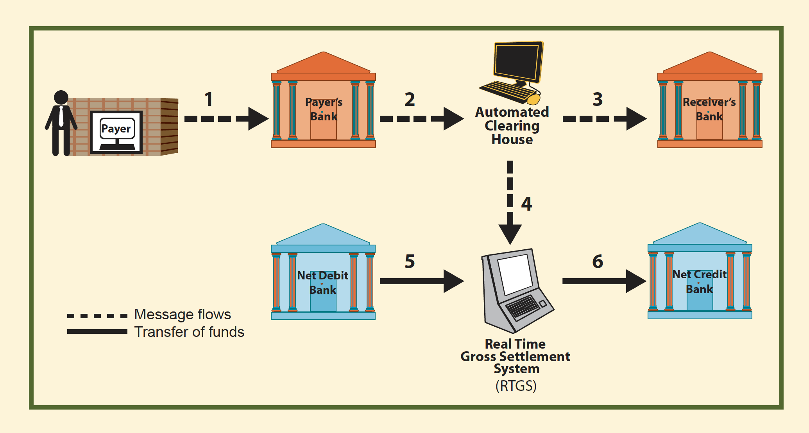

```{r setup, include=FALSE}
knitr::opts_chunk$set(echo = TRUE,
                      warning = FALSE,
                      message = FALSE,
                      comment = "",
                      fig.width = 11)
xaringanExtra::use_tile_view()
xaringanExtra::use_panelset()
xaringanExtra::use_webcam()
xaringanExtra::use_editable()

library(tidyverse)
library(readxl)
library(hrbrthemes)
library(lubridate)
library(scales)
library(gt)
library(plotly)
thousand <- 1000
hundred <- 100
million <- 1000000

debit_cards <- read_csv("data/DebitCardTransactions.csv") %>% 
  mutate(DATE = my(DATE)) %>% 
  rename(Year = YEAR)
credit_cards <- read_csv("data/CreditCardTransactions.csv") %>% 
  mutate(DATE = my(PERIOD),
         Year = year(DATE)) 
ydl <- read_csv("data/year_days_lookup.csv")
```


```{r echo = FALSE}
cc_year <- credit_cards %>% 
  group_by(Year) %>% 
  summarise(`POS transactions` = sum(POSVOLUME),
            `POS Value` = sum(POSVALUE_TTM),
            `ATM transactions` = sum(ATM_VOLUME),
            `ATM value` = sum(ATMVALUE_TTM)) %>% 
  left_join(ydl) %>% 
  mutate(`CC Point of Sale transactions per day` = paste0(round(`POS transactions`/(thousand*Days)),"k"),
         `CC ATM withdrawals per day` = paste0(round(`ATM transactions`/(thousand*Days)),
                          "k")) %>% 
  select(Year, `CC Point of Sale transactions per day`, `CC ATM withdrawals per day`)

dc_year <- debit_cards %>% 
  group_by(Year) %>% 
  summarise(`POS transactions` = sum(POSVOLUME),
            `POS Value` = sum(POSVALUE_TTM),
            `ATM transactions` = sum(ATMVOLUME),
            `ATM value` = sum(ATMVALUE_TTM))  %>% 
  left_join(ydl) %>% 
  mutate(`DC Point of Sale transactions per day` = paste0(round(`POS transactions`/(thousand*Days)),
                          "k"),
         `DC ATM withdrawals per day` = paste0(round(`ATM transactions`/(thousand*Days)),
                          "k")) %>% 
  select(Year, `DC Point of Sale transactions per day`, `DC ATM withdrawals per day`)

daily_volumes <- left_join(dc_year, cc_year)
daily_vol_tbl <- daily_volumes %>% 
  gt() %>% tab_spanner(
    label = "Credit cards",
    columns = vars(
      `CC Point of Sale transactions per day`, `CC ATM withdrawals per day`)
  ) %>% tab_spanner(
    label = "Debit cards",
    columns = vars(
      `DC Point of Sale transactions per day`, `DC ATM withdrawals per day`)
  ) %>% cols_align(
    align = "center",
    columns = vars(`DC Point of Sale transactions per day`, `DC ATM withdrawals per day`,
                   `CC Point of Sale transactions per day`, `CC ATM withdrawals per day`)
  ) %>% tab_style(
    style = list(
      cell_borders(
        sides = "right",
        color = "blue",
        weight = px(3)
      )
    ),
    locations = list(
      cells_body(
        columns = vars(Year, `DC ATM withdrawals per day`,
                       `CC ATM withdrawals per day`)
      )
    )
  )


dc_narrow <- debit_cards %>% 
  select(DATE, ATMVALUE_TTM, POSVALUE_TTM) 

cc_narrow <- credit_cards %>% 
  select(DATE, POSVALUE_TTM) %>% 
  rename(CC_POS = POSVALUE_TTM)


payments_long <- left_join(dc_narrow, cc_narrow)  %>% 
  pivot_longer(c(ATMVALUE_TTM, POSVALUE_TTM, CC_POS), 
               names_to = "Measure", values_to = "Value")


#daily_vol_tbl
```

## A little bit of terminology to start 


  * **Retail payments**: transactions below $500,000 TTD

--

  * **Wholesale payments**: transactions above $500,000 TTD

--

  * **Volume**: number of transactions of a particular type (a count)

--

  * **Value**: total monetary value of transactions of a certain type (a sum)
    

---
## How can you make payments in Trinidad and Tobago

There are several payment media:

--
  
  1. Cash
  
--
  
  2. Cheques
  
--
  
  3. Electronic Payments, including:

--
    * Debit Cards

--
    * Credit Cards
--
    * ACH (Automated Clearing House): a system for retail payments

--
    * RTGS (Real Time Gross-Settlement System): a system for wholesale payments
    

---
### How common are the different means of making retail payments? (except cash)

```{r echo = FALSE}
rshares <- readxl::read_xlsx("data/RetailShares.xlsx", 
                             sheet = "RetailTable")

media <- c("Debit Cards", "Credit Cards", "ACH", "Cheques")
rshares$Medium <- factor(rshares$Medium, 
                         levels = media)

df <- rshares %>% 
  arrange(Medium) %>%
  group_by(Measure) %>% 
  mutate(Upper = cumsum(Percentage)) %>% 
  ungroup() %>% 
  arrange(Measure) %>% 
  mutate(Medium = as.character(Medium))

vols <- df %>% filter(Measure == "Volume") %>%
  mutate(Lower = lag(Upper, default = 0),
         top = 3, bottom = 2)
vals <- df %>% filter(Measure == "Value") %>%
  mutate(Lower = lag(Upper, default = 0),
         top = 1, bottom = 0)

df <- bind_rows(vols, vals)
ggplot(data = df, aes(xmin = Lower, xmax = Upper, ymin = bottom, ymax = top, fill = Medium)) + 
  geom_rect(alpha = 0.3, color = "gray50") + theme_ipsum() + 
  theme(panel.grid.major = element_blank(),
        panel.grid.minor = element_blank(),
        axis.text.y = element_blank(),
        legend.position = "bottom",
        plot.subtitle = element_text(size = 16)) + 
  scale_x_continuous(labels = function(x) paste0(x, "%"), sec.axis = dup_axis()) + 
  guides(fill = guide_legend(reverse=T)) + 
  annotate("text", x = 50, y = 0.5, label = "Monetary value", size = 20, color = "brown", alpha = 0.4) + 
annotate("text", x = 50, y = 2.5, label = "# of transactions", size = 20, 
         color = "brown", alpha = 0.4) + 
  labs(x = "", title = "Volume and value of retail payment methods",caption = "data: Central Bank of Trinidad and Tobago",
       subtitle = "The most frequently-used means of transactions contribute a minority of the total value of retail payments and vice versa.")
```
    
---
## Debit/Credit cards: what's the deal?

**Debit cards**:

  1. are linked to an account accessible via a network
  
  2. deduct the value of the payment from the linked account 
  
  2. allow payments up to the available balance in the account 
  
  

**Credit cards**:

  1. are linked to a line of credit that can be verified via a network
  
  2. deduct the value of the payment from the line of credit 
  
  3. allow payments up to the available balance 
  
  4. have outstanding balances that accrue interest 
  
  
---
## How many debit cards and credit cards are there in T&T?

A lot. In November 2020: 

  * ~ **670,000** debit cards
  
  * ~ **228,000** credit cards
  


---
### Debit and credit cards: in pictures


.panelset[

.panel[.panel-name[Value of transactions]

```{r echo = FALSE, warning = FALSE}
cc_vals <- credit_cards %>% 
  mutate(PERIOD = ymd(DATE)) %>% 
  select(PERIOD, `ATMVALUE_TTM`, `POSVALUE_TTM`) %>% 
  mutate(`CC ATM withdrawals` = ATMVALUE_TTM*million, 
         `CC POS purchases` = POSVALUE_TTM*million) %>% 
  select(1, 4, 5)


dc_vals <- debit_cards %>% 
  mutate(PERIOD = ymd(DATE)) %>% 
  select(PERIOD, ATMVALUE_TTM, POSVALUE_TTM) %>% 
  mutate(`DC ATM withdrawals` = ATMVALUE_TTM*million,
         `DC POS purchases` = POSVALUE_TTM*million) %>% 
  select(1, 4, 5)

dfv <- left_join(cc_vals, dc_vals) %>% 
  pivot_longer(2:5, names_to = "Transaction type", values_to = "value")

ggplot(dfv,
       aes(x = PERIOD, y = value, group = `Transaction type`, color = `Transaction type`)) + 
  geom_line() + geom_point() + 
  theme_ipsum() + 
  labs(title = "Value of Debit card and credit card transactions",
       caption = "data: Central Bank of Trinidad and Tobago", x = "", y = "TTD") + 
  theme(legend.position = "bottom",
        legend.title = element_blank()) + 
  scale_y_continuous(labels = comma)
```
  

]


.panel[.panel-name[Volume of transactions]

```{r echo = FALSE}
cc_vols <- credit_cards %>% 
  mutate(PERIOD = ymd(DATE)) %>% 
  select(PERIOD, `ATM_VOLUME`, `POSVOLUME`) %>% 
  mutate(`CC ATM withdrawals` = ATM_VOLUME, 
         `CC POS purchases` = POSVOLUME) %>% 
  select(1, 4, 5)


dc_vols <- debit_cards %>% 
  mutate(PERIOD = ymd(DATE)) %>% 
  select(PERIOD, ATMVOLUME, POSVOLUME) %>% 
  mutate(`DC ATM withdrawals` = ATMVOLUME,
         `DC POS purchases` = POSVOLUME) %>% 
  select(1, 4, 5)

dfvols <- left_join(cc_vols, dc_vols) %>% 
  pivot_longer(2:5, names_to = "Transaction type", values_to = "volume")


ggplot(dfvols,
       aes(x = PERIOD, y = volume, group = `Transaction type`, color = `Transaction type`)) + 
  geom_line() + geom_point() + 
  theme_ipsum() + 
  labs(title = "Volume of debit card and credit card transactions",
       caption = "data: Central Bank of Trinidad and Tobago", x = "", y = "# of transactions") + 
  theme(legend.position = "bottom",
        legend.title = element_blank()) + 
  scale_y_continuous(labels = comma)

```

]

.panel[.panel-name[Avg transaction value]

```{r echo = FALSE}
cc_avg <- credit_cards %>% 
  mutate(`CC ATM avg withdrawal` = ATMVALUE_TTM*million/ATM_VOLUME,
         `CC POS avg purchase` = POSVALUE_TTM*million/POSVOLUME,
         PERIOD = ymd(DATE)) %>% 
  select(PERIOD, `CC ATM avg withdrawal`, `CC POS avg purchase`)

dc_avg <- debit_cards %>% 
  mutate(PERIOD = ymd(DATE)) %>% 
  mutate(`DC ATM avg withdrawal` = ATMVALUE_TTM*million/ATMVOLUME,
         `DC POS avg purchase` = POSVALUE_TTM*million/POSVOLUME) %>% 
  select(PERIOD, `DC ATM avg withdrawal`, `DC POS avg purchase`)

dfa <- left_join(cc_avg, dc_avg) %>% 
  pivot_longer(2:5, names_to = "Transaction type", values_to = "value")

ggplot(data = dfa, 
       aes(x = PERIOD, y = value, group = `Transaction type`, color = `Transaction type`)) + 
  geom_line() + geom_point() + theme_ipsum() + 
  labs(title = "Average Debit card and credit card transaction value",
       caption = "data: Central Bank of Trinidad and Tobago", x = "", y = "TTD") + 
  theme(legend.position = "bottom",
        legend.title = element_blank())
  
```
  
]
]


---
## Debit card transaction processing

  1. Authorisation: verification that the purchase is within the cardholder's balance

  
  2. Payment and clearance: actual movement of value. 
  
  

---
## Debit card brands

  * **LINX**: locally-branded debit cards
  
  * Internationally-branded cards: VISA and MasterCard
  
  
  
---
## LINX


Key facts 

  * A product of Infolink Services Limited (ISL) est. September 13, 1994 as a joint venture between the four major financial institutions in Trinidad & Tobago

  * Other entities have joined the LINX network over time: 
      
      * Eastern Credit Union (2007)
      
      * Bank of Baroda (2010)

      * JMMB (2012)
      
      * CIBC (2018)
      
  * Currently switches over 36 million transactions per year
  


---
### LINX 2018 to 2020

```{r echo = FALSE}
linx <- readxl::read_xlsx("data/LINXSummary.xlsx", 
                          sheet = "LINX_Summary") %>%
  mutate(Transactions = comma(Transactions),
         `Transactions per day` = comma(`Transactions per day`),
         `Annual Fees (TTD @ $0.75/transaction)` = comma(`Annual Fees (TTD @ $0.75/transaction)`))

linx_tbl <- linx %>% gt() %>% cols_align(
    align = "right",
    columns = vars(`Transactions`, `Transactions per day`, `Annual Fees (TTD @ $0.75/transaction)`)
  )

linx_tbl
```


---
## Cash: How much is there in T&T?

CBTT has a good handle on the value of currency in active circulation:

```{r echo = FALSE}
df <- read_xlsx("data/Money Supply Aggregates (TTMn)  Central Bank of Trinidad and Tobago.xlsx",
                skip = 1) %>% 
  select(1, 2) %>% 
  rename(`CIAC` = 2) %>%
  mutate(Date = my(Date)) %>%
  arrange(Date)

ciac_plt <- ggplot(data = df,
       aes(x = Date, y = `CIAC`)) + 
  geom_line() + geom_point() +
  theme_ipsum_ps() + 
  labs(title = "TTD Currency in Active Circulation",
       subtitle = "Total value of currency in active circulation monthly from August 2009 to November 2020",
       y = "$TTM", x = "", caption = "data: Central Bank of Trinidad and Tobago")

ggplotly(ciac_plt)

```


---
### What volume and value of cash are transacted daily in T&T?

--

Good Question. 

--

I don't know. But it's a lot. Let's go back to the graphs of debit card and credit card transactions.


---
### ACH: What is it? 

The following description is taken verbatim from *The Payments System in Trinidad and Tobago*: 

--

  * used for large volume, low value (under $500,000) payments. Payments sent through the ACH are cleared and settled within 24 hours.

--

  * To use the ACH, an individual (or company) simply has to request a bank to use this means of payment and provide details of the payment such as the amount, the beneficiary’s account number and the date of payment.
  
--

  * Companies can send an electronic file containing multiple payment requests to their bank. (Note if the payer and the beneficiary have the same bank, this would be processed as an internal transfer and there is no need to do an ACH transaction).

--

  * Two types of transactions:
    
    * A direct credit: transfer of a payment from a customer (an individual or company)
into the account of the beneficiary on the instruction of the customer.
    
    * A direct debit is an electronic transfer of a pre-authorised payment
from a customer’s account to the account of a beneficiary on the
instruction of the beneficiary.


---
### ACH: The process in words

  * Customers request their banks to make payments through the ACH.
  
  * The banks deduct funds from their customers’ accounts and electronically send the payment instructions to the ACH.
  
  * The ACH Operator sorts and batches payment instructions received from all banks and (i) forwards instructions to the respective receiving banks to credit beneficiaries’ accounts and (ii) sends a net settlement file to the RTGS to execute the payment.
  
  * The payment is settled on the RTGS by debiting and crediting the respective banks. These steps are
shown in the diagram below.


---
### ACH: The process in a picture



---
### Typical ACH Fees

ACH access comes with a configuration of fees (exact configuration dependent on your bank):

Types of fees:

  * fixed administrative fees
  
  * transaction fee for transfers to accounts at the same bank
  
  * transaction fee for transfer to accounts at other banks
  
  
---
### Example fees: First Citizens Bank

  * Monthly fee: $100
  
  * transfer to other FCB accounts: free
  
  * transfer to accounts at other banks: $1.25 each


---
## RTGS 


The **Real Time Gross Settlement** (RTGS)

  * The RTGS system is owned and managed by the Central Bank. 
  
  * Used for large value ($500,000 and over) or time critical payments of
any amount. 

  * It is the only non-cash system in which value is transferred
from payer to payee with finality almost immediately. 

  * All commercial banks are required to participate in the RTGS system.

  * The process for use of the RTGS is similar to that for the ACH. An
individual or company simply requests a bank to use this system and
provides the required payment details. Unlike with the ACH which
processes payments on a batch basis, the RTGS receives and
processes each transaction individually as the customer makes
the request.

(The contents of this slide are completely plagiarised from *The Payment System in Trinidad and Tobago*, 
a 2009 publication of the CBTT)


