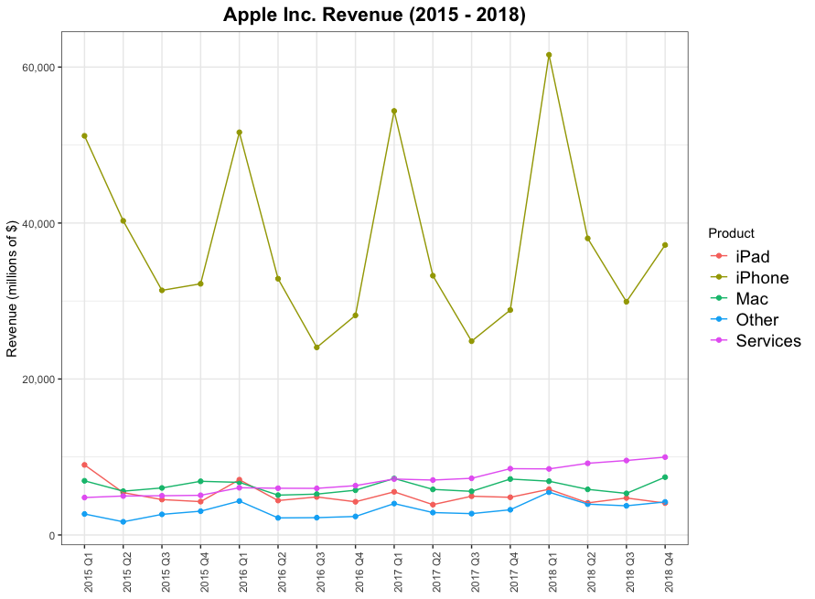
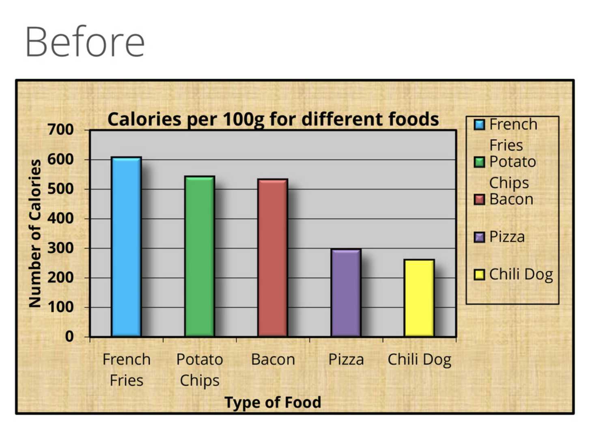
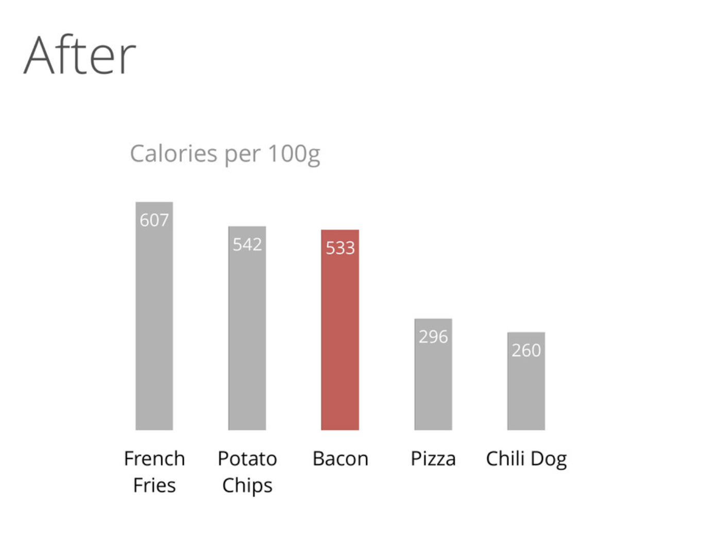

```{r setup, include=FALSE}
options(htmltools.dir.version = FALSE)
knitr::opts_chunk$set(fig.align="center", fig.width=5, fig.height=5, warning = FALSE, message = FALSE)
library(notitia)
library(dplyr)
library(tidyr)
library(ggplot2)
library(scales)
```

### The next slide

--
  * Revenue data from a very famous company 


--

  * Data given per quarter for 2015 to 2018
  

--

  * Revenue broken down into 5 product lines
  
--

  * all numbers are in millions of USD
--
   
    * yes, the numbers are huge 


---
```{r echo = FALSE}
df <- select(apple, -Units) %>% 
  mutate(Product = if_else(Product == "Other Products", "Other", Product)) %>% 
  spread(key = Product, value = Revenue) %>%
  select(Year, Quarter, iPad, iPhone, Mac, Services, Other)
df$Year <- as.character(df$Year)
knitr::kable(df, "html", format.args = list(big.mark = ","))
```

---
### OK, the next slide

  * Has all the same information 
  


---
class: center, middle

```{r echo=FALSE}

```


---
### Communicating numbers can be tricky

--

  * the audience has much less appetite for detail than the analyst
  
--

### Good news: 

--

This is a well-studied problem. Considerations include:

--

  * What are you trying to show?

--

    * quantities, percentages, relationships, variation etc

--
  
  * What are you trying to highlight?
  
--

  * What comparisons are you trying to make? 
  

      
  
  
  

  

---
### More broadly: People get attached to ideas and can be hard to convince

Methods that I've seen actually work (sometimes):
--
  
  * Using data
  
--

  * Repetition
--
    
    * Saying the same thing over and over
    
--

    * And then saying it again
  
--

    * can be tuned out


---
### Overall advice


  * always assess your metrics and your models for appropriateness
  
--


  * keep it simple
  
--

Example from Dark Horse Analytics follows: 
<a href = "https://speakerdeck.com/cherdarchuk/remove-to-improve-the-data-ink-ratio">https://speakerdeck.com/cherdarchuk/remove-to-improve-the-data-ink-ratio</a>

  
  
  
---
class: center, middle

```{r echo=FALSE}

```


---
class: center, middle

```{r echo=FALSE}

```

