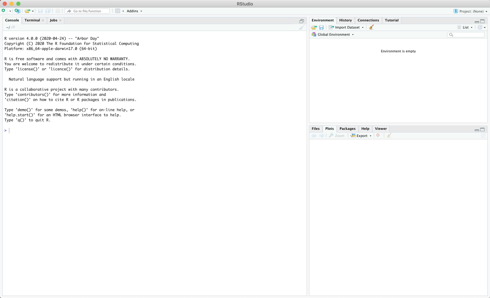

## 1. Install R and RStudio

  * Download R @ The [R Project’s Home Page](https://cloud.r-project.org/)
    
    * Windows: 
      * [https://cloud.r-project.org/bin/windows/base/R-4.0.2-win.exe](https://cloud.r-project.org/bin/windows/base/R-4.0.2-win.exe)
    
    * Mac: 
      * [https://cran.r-project.org/bin/macosx/R-4.0.2.pkg](https://cran.r-project.org/bin/macosx/R-4.0.2.pkg)
    * Linux
      * [https://cloud.r-project.org/bin/linux/](https://cloud.r-project.org/bin/linux/)
    
  * Download RStudio Desktop from [RStudio](https://www.rstudio.com/products/rstudio/download/#download)
    * Windows
      * [https://s3.amazonaws.com/rstudio-ide-build/desktop/windows/RStudio-1.4.869.exe](https://s3.amazonaws.com/rstudio-ide-build/desktop/windows/RStudio-1.4.869.exe)
    * Mac
      * [https://s3.amazonaws.com/rstudio-ide-build/desktop/macos/RStudio-1.4.869.dmg](https://s3.amazonaws.com/rstudio-ide-build/desktop/macos/RStudio-1.4.869.dmg)
    * Linux
      * [https://www.rstudio.com/products/rstudio/download/#download](https://www.rstudio.com/products/rstudio/download/#download)
  
  * Run the installers for R and RStudio, in that order.
  
## 2. Open RStudio

It should look like this when you do:


## 3. Install additional packages and data
  
  * copy-paste the text below into the command window 
  * hit enter
  * accept any defaults if you get prompted
  * this may take a little while. But nothing too exorbitant.
  
```{r eval = FALSE}
install.packages(c("tidyverse", "nycflights13", "devtools"))
```

## 4. Test it out

**Copy-paste the following text into the command window and hit enter**. 

  * If the graphs show up then you have installed all the necessary packages.
  * Don't worry if you don't understand the commands. 


  
```{r message = FALSE}
library(tidyverse)
library(nycflights13)
flights <- flights %>% mutate(cancelled = is.na(arr_delay) & is.na(dep_delay),
Day = ISOdate(year, month, day))
flight_report <- flights %>%
group_by(Day, origin) %>% summarise(Cancelled = mean(cancelled)*100)
ggplot(flight_report, aes(x = Day, y = Cancelled)) +
geom_line() +
facet_wrap(~origin, ncol = 1) +
ylab("% of Flights Cancelled")
```


 

