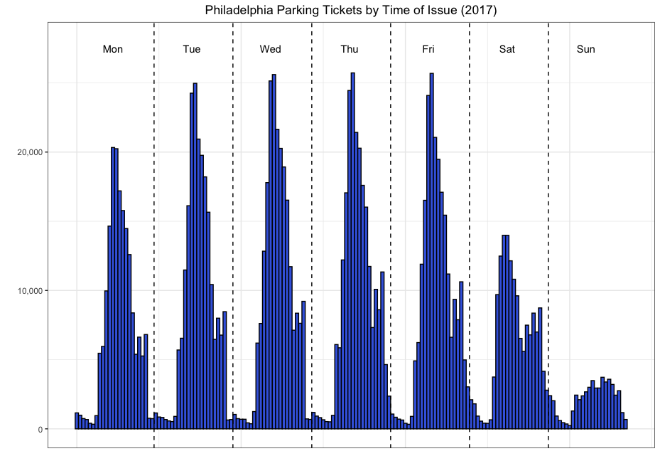
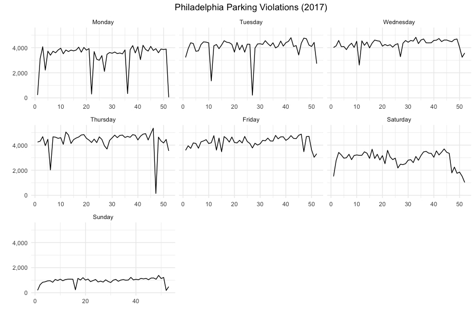
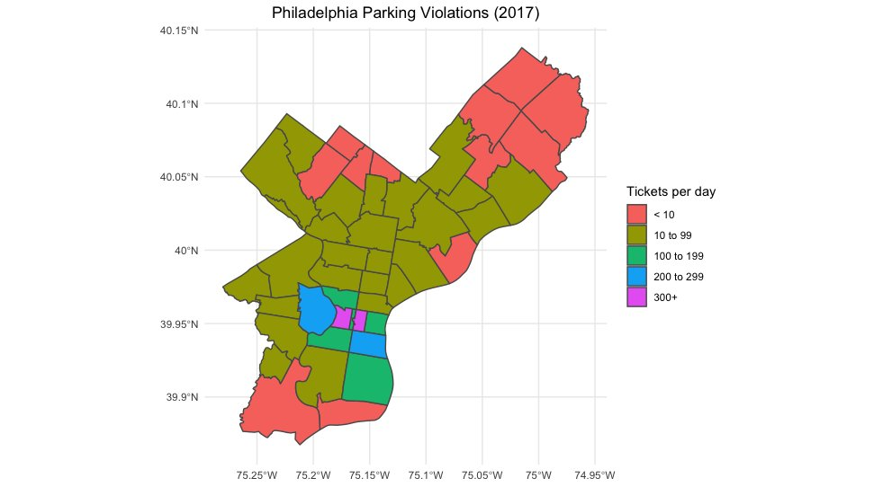
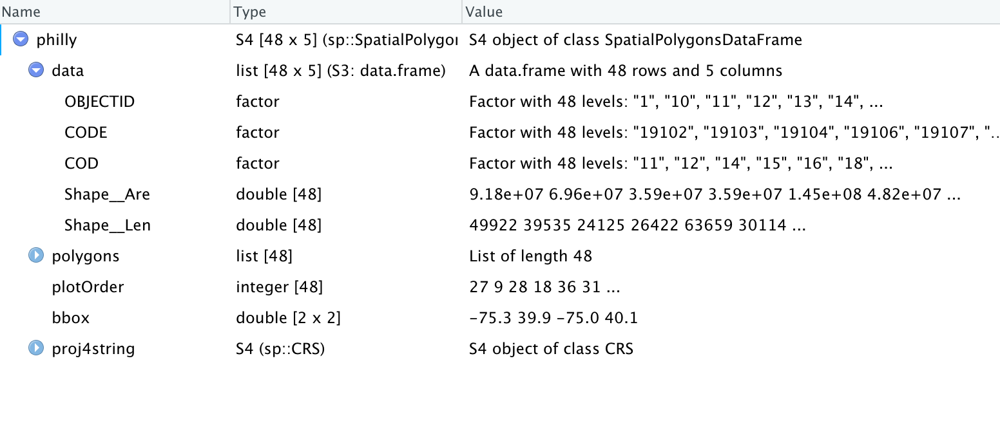

A few weeks ago, I got around to participating in <a href = "https://thomasmock.netlify.com/post/tidytuesday-a-weekly-social-data-project-in-r/">TidyTuesday</a> for the first time. The <a href = "https://github.com/rfordatascience/tidytuesday/tree/master/data/2019/2019-12-03">data set for that week (2019-12-03)</a> contained data related to parking violations in the city of Philadelphia during 2017. 

The plots I made and the code for each are below. 

#### Plots 

{width="51%"}


{width="51%"}


{width="51%"}


I just realized that I did not share the code for any of the plots that I made so I will write it up here. 


```{r setup, include=FALSE}
knitr::opts_chunk$set(echo = TRUE, message = FALSE, warning = FALSE, 
                      fig.align = "center")
```

### Reading data and data manipulation


First, I:

  * read in the data using <tt>read_csv {readr}</tt>
  
  * use <tt>head {utils}</tt> to look at the first few rows of the data

```{r cache = TRUE}
library(readr)

df <- read_csv("https://raw.githubusercontent.com/rfordatascience/tidytuesday/master/data/2019/2019-12-03/tickets.csv") 
head(df)
```


Next, I make the following changes to the data:

  * separate the <i>issue_datetime</i> column into <i>Date</i> and <i>Time</i> columns using <tt>separate {tidyr}</tt>
  
  * use <tt>mutate {dplyr}</tt> to:
  
    * Make the <i>Date</i> column a Date object using <tt>ymd {lubridate}</tt>
    * create a new column, <i>day</i>, indicating the day of the week (e.g. Monday, Tuesday...) each ticket was issued 
  

```{r}
library(dplyr)
library(tidyr)
library(lubridate)

df <- separate(df, issue_datetime, into = c("Date", "Time"), sep = " ") %>%
  arrange(Date, Time) %>% ungroup %>% mutate(Date = ymd(Date),
                                             day = weekdays(Date))
```

The first 6 rows of df now contain the following information:

```{r echo = FALSE}
library(knitr)
kable(head(df))
```


## Plot 1: Histogram of ticket issue times (hour)


### Adding new variables

For this plot, I create new variables to:

  * determine an offset corresponding to the day of the week 
  * determine the hour of day (from 0-23) each ticket was issued
  * take the sum of the two values above so each of the 168 hours of the week is differentiated

#### Calculating an offset for each day

I created a data frame with the offset for each day:

```{r}
day <- c("Monday", "Tuesday", "Wednesday", "Thursday",
  "Friday", "Saturday", "Sunday")
offset <- (0:6)*24

daylookup <- data.frame(day, offset)
daylookup
```


#### Assigning each ticket an incident hour from 0 to 167

To assign each ticket to one of the 168 hours of the week, I carried out the following steps:

  * create a new variable <i>hr</i> by splitting the existing variable <i>Time</i>
  * convert <i>hr</i> into a numeric variable
  * join the main data set to the table of offsets, <i>daylookup</i>
  * create a new variable, <i>incident_hr</i>, of values 0-167 corresponding to the hour of the week.
  

```{r}
df_hms <- separate(df, Time, into = c("hr", "minute", "second")) %>%
  mutate(hr = as.numeric(hr)) %>% left_join(daylookup) %>%
  mutate(incident_hr = offset+hr)
```  
  
  
### Making the plot   
  
Now, I can make the plot using <tt>ggplot {ggplot2}</tt> using a histogram geometry.   
  
  
```{r}
library(ggplot2)
library(scales)

ggplot(data  = df_hms, aes(x = incident_hr)) +
  geom_histogram(fill = "royalblue", colour = "black", bins = 168) +
  theme(plot.title = element_text(hjust = 0.5)) +
  scale_y_continuous(label = comma) + xlab("") + ylab("") + theme_bw() +
  ggtitle("Philadelphia Parking Tickets by Time of Issue (2017)") +
  theme(plot.title = element_text(hjust = 0.5)) 
```


### Annotating the plot

Then I annotated the plot by adding:

  * vertical lines to separate the days of the week using <tt>geom_vline {ggplot2}</tt>
  * text to insert the day names using <tt>annotate {ggplot2}</tt>

```{r}
ggplot(data  = df_hms, aes(x = incident_hr)) +
  geom_histogram(fill = "royalblue", colour = "black", bins = 168) +
  theme(plot.title = element_text(hjust = 0.5)) +
  scale_y_continuous(label = comma) + xlab("") + ylab("") + theme_bw() +
  ggtitle("Philadelphia Parking Tickets by Time of Issue (2017)") +
  theme(plot.title = element_text(hjust = 0.5)) + 
  geom_vline(xintercept = 23.5, linetype = "dashed") +
  geom_vline(xintercept = 47.5, linetype = "dashed") +
  geom_vline(xintercept = 71.5, linetype = "dashed") +
  geom_vline(xintercept = 95.5, linetype = "dashed") +
  geom_vline(xintercept = 119.5, linetype = "dashed") +
  geom_vline(xintercept = 143.5, linetype = "dashed") + 
  annotate("text", x = 12, y = 27000, label = "Mon") +
  annotate("text", x = 36, y = 27000, label = "Tue") +
  annotate("text", x = 60, y = 27000, label = "Wed") +
  annotate("text", x = 84, y = 27000, label = "Thu") +
  annotate("text", x = 110, y = 27000, label = "Fri") +
  annotate("text", x = 134, y = 27000, label = "Sat") +
  annotate("text", x = 158, y = 27000, label = "Sun")
```


## Plot 2: Day of week details


As background work to create this plot, I:

  * create a 0-1 variable <i>newday</i> to flag all the rows of the data where the date is not the same as the date of the row above it. This identifies the start of the records for each day because the data has already been sorted by datetime. 
  * calculate the day of the year, <i>daynum</i> for each row by taking the cumulative sums of the <i>newday</i> column
  * determine the week of the year by taking the remainder when <i>daynum</i> is divided by 7 (and adding 1 so the weeks start at 1 and not 0).

```{r}
df$newday <- ifelse(df$Date == lag(df$Date), 0, 1)
df$newday <- ifelse(is.na(df$newday), 1, df$newday)

df$daynum <- cumsum(df$newday)
df$week <- ((df$daynum - 1) %/% 7) + 1
```


### Finding total tickets per day 


Next I did a few more data manipulation operations:

  * aggregating total tickets per day over the <i>week</i> and <i>day</i> variables
  
  * make <i>day</i> a factor with levels corresponding to the days of the week (Monday to Sunday)
  

```{r}
agg_week <- group_by(df, week, day) %>% summarise(Tickets = n())
aw <- agg_week
aw$day <- factor(aw$day, levels = c("Monday", "Tuesday", "Wednesday", "Thursday",
                                    "Friday", "Saturday", "Sunday"))
```

### Making a faceted line chart 

Now to make a <tt>ggplot {ggplot2}</tt> with 
  * with a line geometry 
  * faceted on the <i>week</i> variable

```{r}
library(ggplot2)
library(scales)

wkday_plt <- ggplot(data = aw, aes(x = week, y = Tickets)) + geom_line() +
  facet_wrap(~day, scales="free_x") + theme_minimal() +
  ggtitle("Philadelphia Parking Violations (2017)") +
  theme(plot.title = element_text(hjust = 0.5)) +
  scale_y_continuous(label = comma) + xlab("") + ylab("")

wkday_plt
```


### Alternative way to make a very similar chart

After making the chart, I realized that I could have made essentially the same chart simply by using <i>Date</i> as the x variable input. The only difference would be that the x-axis values would be dates instead of the week numbers. (I remove the dates on the x-axis anyway below.)


```{r}
df_agg_day <- group_by(df, Date, day) %>% summarise(Tickets = n()) %>% ungroup()
df_agg_day$day <- factor(df_agg_day$day, levels = c("Monday", "Tuesday", "Wednesday", "Thursday",
                                    "Friday", "Saturday", "Sunday"))

wkday_plt2 <- ggplot(data = df_agg_day, aes(x = Date, y = Tickets)) + geom_line() +
  facet_wrap(~day) + theme_minimal() +
  ggtitle("Philadelphia Parking Violations (2017)") +
  theme(plot.title = element_text(hjust = 0.5),
        axis.text.x = element_blank()) +
  scale_y_continuous(label = comma) + xlab("") + ylab("")

wkday_plt2
```

### Making an interactive chart for the web with plotly

In the time since I originally made this plot, I have been using the <tt>plotly</tt> library. I think this is a good opportunity to demonstrate how easily it allows you to make an interactive chart for the web. 

It's really very simple:

  * create a <tt>ggplot</tt>
  
  * use the plot created as input to <tt>ggplotly</tt>

```{r}
library(plotly)
ggplotly(wkday_plt2)
```

You can now hover over the chart and see the total tickets issued on a specific day and see the exact date. It's a lot of functionality for very little effort.  


## Plot 3: Mapping parking violations by zip code 

The key steps for making this plot are:
  
  * finding the average number of tickets per day in each zip code
  
  * putting the zip codes into groups 
  
  * merging the numerical data to geospatial data corresponding to the shapes of the different zip codes represented in the data


### Calculating tickets per day and grouping zip codes 

  * use <tt>group_by {dplyr}</tt> and <tt>summarise {dplyr}</tt> to find the average number of tickets per day. (And don't forget to ungroup with <tt>ungroup {dply}</tt> when you are done.)
  
  * add a new variable, <i>Tickets per day</i> to bucket the zip codes into 5 ranges

```{r results = "hide"}
df_zip <- group_by(df, zip_code) %>% 
  summarise(Tickets = n()/365) %>% 
  ungroup() %>% 
  mutate(`Tickets per day` = ifelse(Tickets < 10, "< 10", 
                                    ifelse(Tickets < 100, "10 to 99",
                                           ifelse(Tickets < 200, "100 to 199",
                                                  ifelse(Tickets < 300, "200 to 299", "300+")))))
```

I really should learn how to avoid so many nested <tt>ifelse</tt> statements. I'm sure R -- or a widely-used package -- has a case statement. 

### Reading in shapefile (.shp)


I was able to get a <a href = "Zipcodes_Poly/Zipcodes_Poly.shp">shapefile for the zip codes of Philadelphia</a> from <a href = "https://www.opendataphilly.org/dataset/zip-codes/resource/4cb98d0e-24e1-484b-936c-ddbe255a2ec1">OpenDataPhilly</a>.

To read it in, I used the <tt>readOGR {rgdal}</tt> function which reads the shapefile into a Spatial vector object. 


```{r results = "hide"}
library(rgdal) # will load sp package as well 
philly <- readOGR("Zipcodes_Poly/Zipcodes_Poly.shp")
```


Looking at the created object, <i>philly</i> in the Viewer window we can see that the <i>CODE</i> field (contained in <i>data</i>) contains the 48 zip codes corresponding to the 48 polygons in <i>polygons</i>. 



### Merging shapefile with ticket frequency data

Next we can merge the data frame, <i>df_zip</i> (containing the average tickets per day for each zip code) with the Spatial object, <i>philly</i> (containing the specification of the polygons for the zip codes). 

We can do this using <tt>merge {sp}</tt>. I load the <tt>sf</tt> package as I will be using another function from it immediately after. 

```{r}
library(sf)
philly <- merge(philly, df_zip, by.x = "CODE", 
                        by.y = "zip_code")
```

### Converting to an sf object 

Now we convert <i>philly</i> to an <a href = "https://cran.r-project.org/web/packages/sf/index.html"><tt>sf</tt> (Simple Features)</a> object which will work very easily with <tt>ggplot {ggplot2}</tt>. 
```{r}
phi_sf <- st_as_sf(philly)
```


### Making the plot

Actually making the plot with <tt>ggplot</tt> is very simple: just use the <tt>geom_sf {ggplot2}</tt> to use a simple features geometry and indicate that <i>Tickets per day</i> is the variable we want to use as the fill color for each zip code.

```{r}
library(ggplot2)
ggplot() + geom_sf(data = phi_sf, aes(fill = `Tickets per day` )) + theme_minimal() +
  ggtitle("Philadelphia Parking Violations (2017)") + 
  theme(plot.title = element_text(hjust = 0.5))

```


Strictly speaking, these per day averages may be incorrect as approximately 14% of the tickets in the raw data have no corresponding zip code. So these averages are really lower bounds for 2017.


So that's it. The plots I made for TidyTuesday on 2019-12-03. Until next time.


```{r out.width = "5%", echo = FALSE}

```


