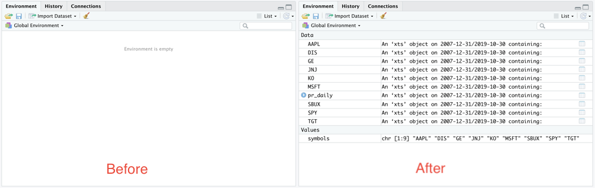

```{r setup, include=FALSE}
knitr::opts_chunk$set(echo = TRUE, message = FALSE, warning = FALSE, 
                      fig.align = "center")
```


I recently came across <a href = "https://resources.rstudio.com/webinars/reproducible-finance-with-r-jonathan-regenstein"><i>Reproducible Finance with R</i></a> an <a href = "https://resources.rstudio.com/webinars">RStudio Webinar</a> conducted by <a href = "https://twitter.com/jkregenstein">Jonathan Regenstein</a>.

Regenstein is the author of a <a href = "https://www.crcpress.com/Reproducible-Finance-with-R-Code-Flows-and-Shiny-Apps-for-Portfolio-Analysis/Jr/p/book/9781138484030">book of the same title</a> and the webinar is a walkthrough of some common tasks in portfolio analysis. 

In the webinar, each task is done in three different ways to illustrate three common paradigms used by R practitioners. I decided to reproduce the tasks using one approach in particular: what Regenstein refers to as the <i>xts</i> approach (based on a key R package, <tt>xts</tt>).    


## R packages used

The code in this notebook utilizes functions in 9 packages. 

  * <b>xts ecosystem packages</b>
    * <tt>PerformanceAnalytics</tt>: Econometric tools for performance and risk analysis
    * <tt>quantmod</tt>: Quantitative Financial Modelling Framework
    * <tt>xts</tt>: Extensible time series class and methods, extending and behaving like zoo.
    * <tt>zoo</tt>: infrastructure for regular and irregular time series. (This a requirement for all of the other packages listed above.)
  * <b>packages used for data visualization</b>
    * <tt>ggplot2</tt>: data viz package for R 
    * <tt>highcharter</tt>: an htmlwidget interface to the <i>Highcharts</i> JavaScript charting library
  * <b>other packages </b>
    * <tt>purrr</tt>: for <tt>map</tt> and <tt>reduce</tt> functions
    * <tt>tidyr</tt>: for <tt>gather</tt> function to reshape data
    * <tt>dplyr</tt>: for <tt>filter</tt> function to subset data
  

All of these packages can be loaded by running the following code:
  
```{r message = FALSE}
library(PerformanceAnalytics)
library(quantmod)
library(xts) 
library(ggplot2)
library(highcharter)
library(purrr)
library(tidyr)
library(dplyr)
```


## Choosing a portfolio

In the webinar, a portfolio of ETFs was used. I used a portfolio of 9 names which I more or less chose off the top of my head (with the exception of <i>SPY</i> which was one of the tickers used in the webinar portfolio.) 

  * AAPL: Apple Inc.
  * DIS: Walt Disney Co
  * GE: General Electric Company
  * JNJ: Johnson & Johnson
  * KO: Coca-Cola Co
  * MSFT: Microsoft Corporation
  * SBUX: Starbucks Corporation
  * SPY: SPDR S&P 500 ETF Trust
  * TGT: Target Corporation


## Getting the data (from Yahoo Finance)


To get the historical data for my portfolio, I copied the webinar code verbatim, altering only the list of symbols to correspond to my own portfolio:

```{r message = FALSE, cache = TRUE}
symbols <- c("AAPL", "DIS", "GE", "JNJ", "KO", "MSFT", "SBUX", "SPY", "TGT")
pr_daily <- getSymbols(symbols, src = "yahoo",
           from = "2007-12-31",
           to = "2019-10-31",
           auto.assign = TRUE) %>% 
  map(~Ad(get(.))) %>% 
  reduce(merge)
```


To see what the created object looks like we can look at the first few rows:

```{r}
head(pr_daily)
```


### Breaking down the code above

The chain of calls above was not trivial, especially as I had not used any of the <tt>quantmod</tt> functions before. So I'll break it up into steps to make sure I(we) understand what each step is doing.  

The code makes the following calls  -- taking the output from each as the input to the following:

  1. <tt>getSymbols</tt>: to get price data from Yahoo Finance

  2. <tt>map</tt>: to apply the function <tt>Ad</tt> on multiple items

  3. <tt>reduce</tt>: to combine results 
  
So it is equivalent to the following: 

```{r message = FALSE}
symbols <- getSymbols(symbols, src = "yahoo",
           from = "2007-12-31",
           to = "2019-10-31",
           auto.assign = TRUE)
int_data <- map(symbols, ~Ad(get(.)))
final_data <- reduce(int_data, merge)
```


I'll run each line of code on its own. First the call to <tt>getSymbols</tt>:

```{r message = FALSE}
symbols <- getSymbols(symbols, src = "yahoo",
           from = "2007-12-31",
           to = "2019-10-31",
           auto.assign = TRUE)
```

Upon running, this function I can confirm that <tt>getSymbols</tt> is primarily run for its side-effects: the vector <tt>symbols</tt> contains simply the tickers in the portfolio but the environment now has data objects corresponding to each name in the portfolio.



Picking the first of these newly-created objects (in alphabetical order) we can see what they look like:

```{r}
head(AAPL)
```

Each row contains a summary of the prices recorded during the corresponding day. 

Next to run the call to <tt>map{purrr}</tt>. The intermediate data object created, <tt>int_data</tt> is a list of 9 xts objects. 

So we can see that this call isolates the Adjusted column for each name from the larger object that contains more fields. 

```{r}
int_data <- map(symbols, ~Ad(get(.)))
head(int_data[[1]])
```

Finally, we run the call to <tt>reduce{purrr}</tt>, which binds all the objects created into a single xts object. For confirmation, the final object should be the same as the <tt>pr_daily</tt> object we created previously.

```{r}
final_data <- reduce(int_data, merge)
head(final_data)
```


Next we rename the fields so they can be a little neater. 


```{r}
names(pr_daily) <- symbols
head(pr_daily)
```

## Getting monthly returns

Computing monthly returns consists of two steps:

  * filtering the data down to the last day of each month
  * calculating the month-on-month returns

### Filtering the data

The first step in getting monthly returns is to filter the data down to the last entries of each month. To do this <tt>to.monthly {xts}</tt> is used:

```{r}
pr_monthly <- to.monthly(pr_daily, indexAt = "lastof", OHLC = FALSE)
head(pr_monthly)
```

### Calculating returns

<tt>Return.calculate {PerformanceAnalytics}</tt> is then used to calculate the log returns. (The call to <tt>na.omit</tt> has the effect of removing the first row of the data which has no entry for monthly returns)

```{r}
rt_monthly <- na.omit(Return.calculate(pr_monthly, method = "log"))
head(rt_monthly)
```


### Adding portfolio weights

I made a choice to give each name in the portfolio equal weight whenever the portfolio is being rebalanced. So first, we create a vector of weights and then use <tt>
Return.portfolio {PerformanceAnalytics}</tt> to get the monthly returns for the rebalanced portfolio. 

```{r}
pw <- rep(1/9, 9)

rt_rebal_mo <- Return.portfolio(rt_monthly, weights = pw, 
                                    rebalance_on = "months")
```

This creates an xts object of portfolio returns for a portfolio rebalanced monthly:

```{r}
head(rt_rebal_mo)
```


#### The date is a row index. And not contained in a column of the data.  

Just taking a pause to note that the date is the row index, an essential ingredient of an xts object. (This was pointed out in the webinar.)

```{r}
head(index(rt_rebal_mo))
```


## Ok, now for some useful calculations

Next we use some of the functions provided by the <tt>PerformanceAnalytics</tt> package to calculate common summary statistics for the portfolio.

### Standard Deviation of returns


We can get the standard deviation of the returns using <tt>StdDev {PerformanceAnalytics}</tt>.
```{r}
sd_rt <- StdDev(rt_rebal_mo)
sd_rt
```

I notice that this appears to be a <b>matrix</b> object. So I checked:

```{r}
class(sd_rt)
```


### Table of Downside Risks

Another useful function is <tt>table.DownsideRisk {PerformanceAnalytics}</tt>, which compiles 11 different risk metrics. 

```{r}
table.DownsideRisk(rt_rebal_mo)
```

### Table of Drawdowns

We can also get a summary of the worst drawdowns in the time period we have data for, using <tt>table.Drawdowns {PerformanceAnalytics}</tt>:

```{r}
table.Drawdowns(rt_rebal_mo)
```
### SemiDeviation

One of the measures included in the table of Downside risks above was the SemiDeviation, the standard deviation of returns below the mean. This summary statistic can be returned as a standalone value using the <tt>SemiDeviation {PerformanceAnalytics}</tt> function.

```{r}
SemiDeviation(rt_rebal_mo)
```


### Sharpe ratio


Another common measure is the [Sharpe ratio](https://en.wikipedia.org/wiki/Sharpe_ratio), which measures the return per unit of risk. For this we use the <tt>SharpeRatio {PerformanceAnalytics}</tt> function.

```{r}
SharpeRatio(rt_rebal_mo)
```


### Returns summary

A general summary of returns can be obtained using <tt>table.Stats {PerformanceAnalytics}</tt>

```{r}
table.Stats(rt_rebal_mo)
```


## Visualizing portfolio performance 

Next, the webinar moved into visualizing the performance of the portfolio. This was done using both <tt>ggplot2</tt> and <tt>highcharter</tt>. I reproduced both and inserted an extra <tt>ggplot2</tt> chart of my own. 

### Combining all returns into one object

The first step we take on the way to visualizing the portfolio's returns is to create a single xts object with the monthly returns of the portfolio (rebalanced monthly) in addition to the returns corresponding to each of the individual tickers. This makes use of<tt>merge.xts {xts}</tt>.

```{r}
rt_rebal_mo <- merge.xts(rt_rebal_mo, rt_monthly)
df <- data.frame(rt_rebal_mo, date = index(rt_rebal_mo))
head(df)
```

### Plotting portfolio returns

<tt>ggplot {ggplot2}</tt> can be used to make a line chart of the entire portfolio's returns over the time period of analysis.

```{r out.width = '90%'}
ggplot(data = df, aes(x = date, y = portfolio.returns)) + 
  geom_line(colour = "brown") + 
  scale_x_date(breaks = scales::pretty_breaks(n = 6)) + 
  ggtitle("Returns by Date") + 
  theme(plot.title = element_text(hjust = 0.5)) 
```


### Visualizing each component compared to the portfolio

Next, I decided to try to plot the returns of each portfolio component in contrast to the aggregate returns. To do this I first reshaped the data using <tt>gather {tidyr}</tt> to get it into a good format for using <tt>ggplot {ggplot2}</tt> later on. (After the reshaping, I output one line per ticker to illustrate the format of the new data frame.)

```{r}
df_narrow <- gather(df, key = "Component", value = "Return", -date)
df_narrow[c(1, 143, 285, 427, 569, 711, 853, 995, 1137, 1279),]
```


Now that the data has been reshaped, I can plot the returns by portfolio component with the aggregate returns as contrast for each component.

```{r out.width = '90%'}

bg_df <- filter(df_narrow, Component == "portfolio.returns") %>% 
  select(-Component)
ggplot(data = filter(df_narrow, Component != "portfolio.returns")) +
  geom_line(data = bg_df, aes(x = date, y = Return), colour = "black") + 
  geom_line(alpha = 0.5, aes(x = date, y = Return, group = Component, colour = Component)) + 
  facet_wrap(~Component) + theme_bw() + 
  theme(legend.position = "none") 
```

I guess it makes sense that <b>SPY</b> would the name that matches the overall portfolio volatility most closely.

## Using highcharter 

I was unacquainted with the <tt>highcharter</tt> package (and the <i>Highcharts</i> JavaScript library that it interfaces with) and I was impressed by the interactive chart/application created by a single function call. I simply copied the webinar code verbatim and ran it. And it worked. 


### Computing rolling standard deviations.

As a preliminary to creating the application, we use the <tt>rollapply {zoo}</tt> function to calculate the rolling 24-month standard deviation of returns of the portfolio:

```{r}
window <- 24

pr_rolling_sd_24 <- rollapply(rt_rebal_mo, FUN = sd,
          width = window) %>% 
  na.omit() 

head(pr_rolling_sd_24)
```

Next, I created the HighChart plot. Again using the code from the webinar (but I make one tiny exception to turn the legend off.)

```{r}
highchart(type = "stock") %>% 
  hc_title(text = "24-Month Rolling volatility") %>% 
  hc_add_series(pr_rolling_sd_24) %>% 
  hc_add_theme(hc_theme_flat()) %>% 
  hc_yAxis(
    labels = list(format = "{value}%"), 
    opposite = FALSE) %>%
  hc_navigator(enabled = FALSE) %>% 
  hc_scrollbar(enabled = FALSE) %>% 
  hc_exporting(enabled = TRUE) %>% 
  hc_legend(enabled = FALSE)

```


I really like this chart and it makes me think that I need to learn more about the Highcharts JavaScript library. 


Anyhow, that's it: the entire walkthrough of the webinar tasks using the xts ecosystem. In the webinar, each of these tasks is also done in two alternative ways: using what he described as <i>tidyverse</i> and <i>tidyquant</i> approaches respectively. I decided to focus on the xts approach because it seemed like the cleanest for the problem at hand.


```{r out.width = "5%", echo = FALSE}
knitr::include_graphics("images/source.jpg")
```


