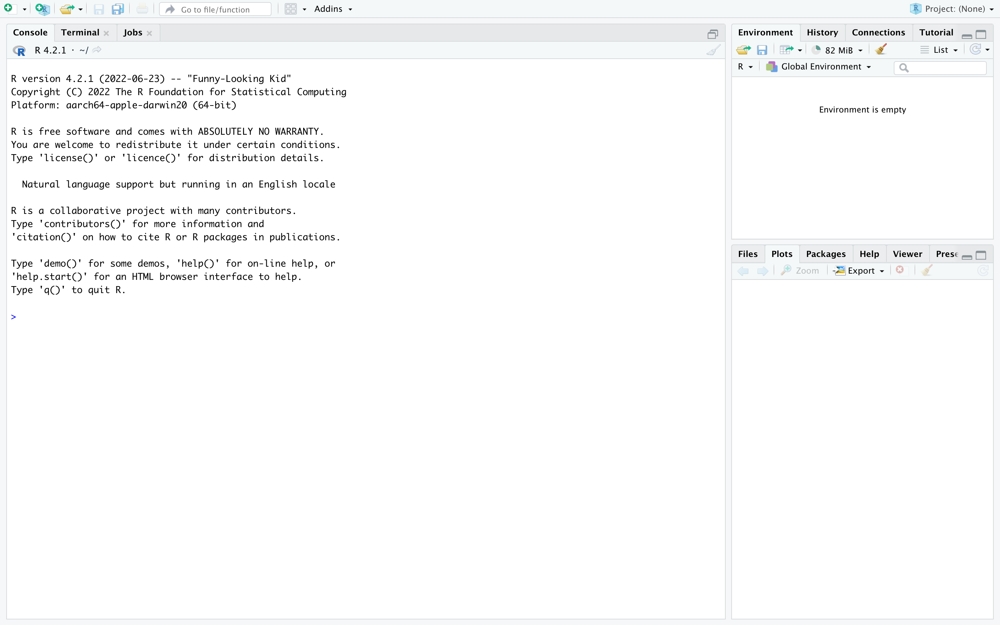
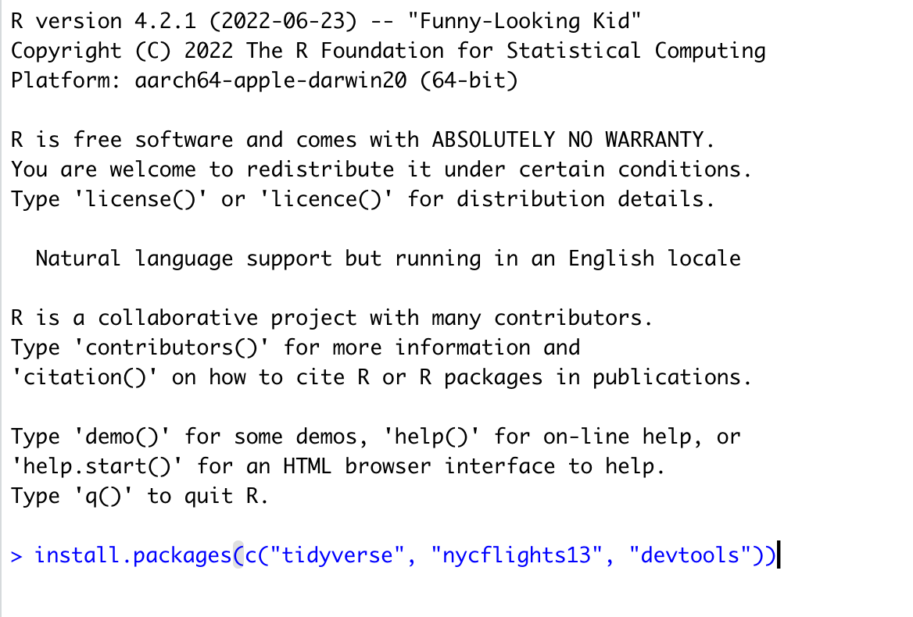

```{r setup, include=FALSE}
knitr::opts_chunk$set(echo = TRUE)
```

### 1. Install R and RStudio


  + Download R @ The R Project’s Home Page

    * Windows: [https://cran.r-project.org/bin/windows/base/R-4.3.0-win.exe](https://cran.r-project.org/bin/windows/base/R-4.3.0-win.exe)
    
    * Mac (ARM: mac models manufactured since November 2020):
        [https://cran.r-project.org/bin/macosx/big-sur-arm64/base/R-4.3.0-arm64.pkg](https://cran.r-project.org/bin/macosx/big-sur-arm64/base/R-4.3.0-arm64.pkg)
    
    * Mac (Intel: models manufactured prior to November 2020)
        [https://cran.r-project.org/bin/macosx/big-sur-x86_64/base/R-4.3.0-x86_64.pkg](https://cran.r-project.org/bin/macosx/big-sur-x86_64/base/R-4.3.0-x86_64.pkg)
    
    * Linux https://cloud.r-project.org/bin/linux/

  + Download RStudio Desktop from RStudio
    
    * Windows [https://download1.rstudio.org/electron/windows/RStudio-2023.03.0-386.exe](https://download1.rstudio.org/electron/windows/RStudio-2023.03.0-386.exe)
    
    * Mac [https://download1.rstudio.org/electron/macos/RStudio-2023.03.0-386.dmg](https://download1.rstudio.org/electron/macos/RStudio-2023.03.0-386.dmg)
    
    * Linux https://www.rstudio.com/products/rstudio/download/#download


**Run the installers for R and RStudio, in that order.**

### 2. Open RStudio

It should look like this when you do:




### 3. Install additional packages and data

  * copy-paste the text below into the command window
  * hit enter
  * accept any defaults if you get prompted
  * this may take a little while. But nothing too exorbitant.


```{r eval = FALSE}
install.packages(c("tidyverse", "nycflights13", "devtools"))
```

**The picture below should show where you paste the command before hitting enter**

{width=50%}


### 4. Test it out

Copy-paste the following text into the command window and hit enter.

**If the graphs show up then you have installed all the necessary packages.** Don’t worry if you don’t understand the commands.


```{r message = FALSE, warning = FALSE}
library(tidyverse)
library(nycflights13)
flights <- flights |> 
  mutate(cancelled = is.na(arr_delay) & is.na(dep_delay),
         Day = ISOdate(year, month, day))

flight_report <- flights |>
  group_by(Day, origin) |> 
  summarise(Cancelled = mean(cancelled)*100)

ggplot(flight_report, aes(x = Day, y = Cancelled)) +
  geom_line() +
  facet_wrap(~origin, ncol = 1) +
  labs(title = "Flight cancellations in NYC 2013", 
       y = "% of Flights Cancelled")
```

**If you are having any difficulty, feel free to contact me via email**: thisisdaryn at gmail dot com

