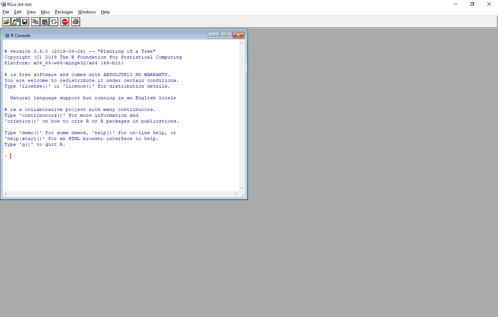
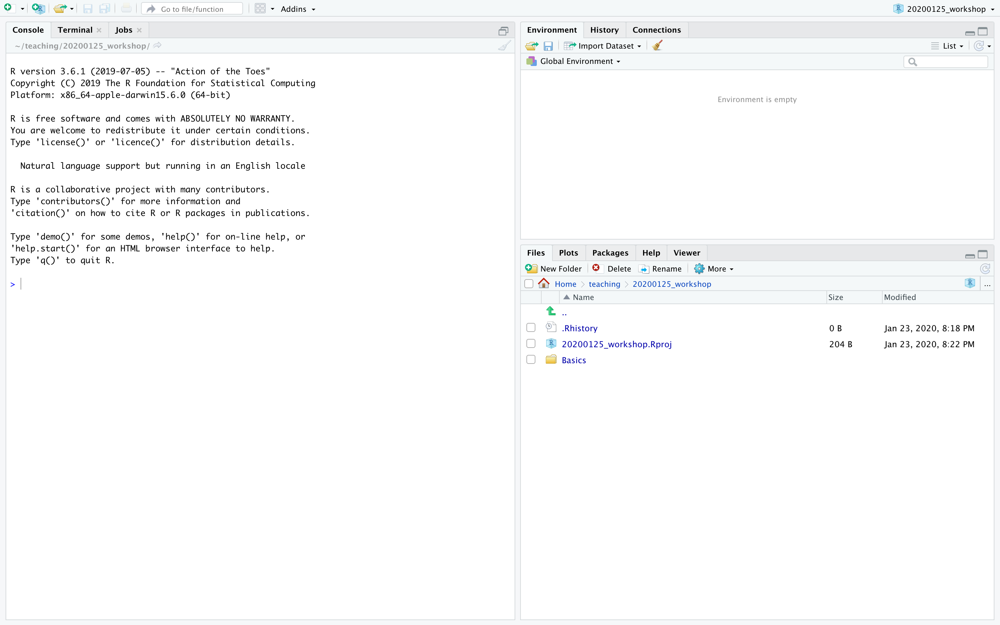

```{r setup, include=FALSE}
options(htmltools.dir.version = FALSE)
knitr::opts_chunk$set(fig.align="center", fig.width=5, fig.height=5, warning = FALSE, message = FALSE)
```

```{r xaringan-themer, include = FALSE}
library(xaringanthemer)
duo_accent(
  primary_color = "ivory",
  secondary_color = "#310A31",
  header_font_google = google_font("Roboto", "400"),
  text_font_google   = google_font("Lato", "300"),
  code_font_family = "Fira Code",
  code_font_url = "https://cdn.rawgit.com/tonsky/FiraCode/1.204/distr/fira_code.css",
  header_color = "#f54278",
  title_slide_text_color = "#354a66"
)
```


### What does R look like?

```{r echo=FALSE}

```


---
### What does RStudio look like?

```{r echo=FALSE}

```


---
## Key panels in RStudio

  - Console pane: 
  
    - interactive window to enter commands 
  
  - Source pane:
    
    - You can write programs here to be saved 
  
  - Environment (and history and connections):
     
     - data objects will show up here 
  
  - Files/Plots/Packages/Help/Viewer
  
  

---
### A first R command

```{r eval = FALSE}
plot(iris$Sepal.Length, iris$Petal.Length)
```


---
### A first R command

```{r}
plot(iris$Sepal.Length, iris$Petal.Length)
```


---
### What just happened?

What do each of the following mean/represent?

  - <tt>plot</tt>
  
  - <tt>()</tt>
  
  - <tt>iris</tt>
  
  - <tt>$</tt> 
  
  - <tt>Sepal.Length</tt>, <tt>Petal.Length</tt>

---
### Ok, same command with one more thing

```{r eval = FALSE}
plot(iris$Sepal.Length, iris$Petal.Length, col = iris$Species)
```

---
### Ok, same command with one more thing

```{r}
plot(iris$Sepal.Length, iris$Petal.Length, col = iris$Species)
```

---
### Ok, same command with one more thing

```{r eval = FALSE}
plot(iris$Sepal.Length, iris$Petal.Length, col = iris$Species)
```


---
### Ok, same command with a different syntax

```{r}
plot(Petal.Length~Sepal.Length, data = iris, col = Species)
```
  

---
### Some terminology

What do we mean by the following terms?

  
  - unit of analysis
  
  - variable 
  
  - numerical variable
  
  - categorical variable
  
  - ordinal (ordered) variable
  
  - record/observation
  
  
  

---
### Answers


  - <b>unit of analysis</b>: the type of entity we are interested in 
    - e.g. a customer, a country
  
  - <b>variable</b>: characteristic of an entity that may change from one individual to another
    - e.g. money spent, GDP/unemployment rate
    
  - <b>numerical variable</b>: variable where the possible values take the form of numbers.
    - e.g. money spent, average age, number of people in a household 
    - it makes sense to do maths with these
    
  - <b>categorical variables</b>: possible values come from a limited set of possible values
    - e.g. male or female; small, medium or large; high income or low income
    
  - <b>ordinal variable</b>: categorical variable with an ordering 
    - e.g. small, medium, or large
    
  - <b>record/observation</b>: all the values of variables collected about the unit of analysis at one time


---
## Weekend checklist: R basics

  - functions, vectors, data frames, packages, types of data
    
  - functions: 
    - <tt>c</tt>
    
    - <tt><-</tt> 
    
    - <tt>[]</tt>
    
    - <tt>$</tt>
    
    - <tt>library</tt> and <tt>install.packages</tt>

  - relational operators:
    
    - <tt>==</tt>, <tt>%in%</tt>, <tt>!=</tt>, <tt>|</tt>, <tt>&</tt> 
    
  - maths/stats functions
    
    - <tt>max</tt>, <tt>min</tt>, <tt>sum</tt>, <tt>mean</tt>, <tt>median</tt>, <tt>sort</tt> etc
    
  - <tt>paste</tt>/<tt>paste0</tt>
  
  - <tt>read.csv</tt>

      
      
---
### Checklist continued

### Exploratory data analysis

  - <tt>summary</tt>
  - <tt>str</tt>
  - <tt>table</tt>
  - plotting in base R:
    - <tt>plot</tt>
    - <tt>hist</tt>
    - <tt>boxplot</tt>
    - <tt>barplot</tt>


---
### Checklist continued: tidyverse functions

  - dplyr 
    - <tt>filter</tt>
    - <tt>arrange</tt>
    - <tt>mutate</tt>
    - <tt>group_by</tt>
    - <tt>summarise</tt>
    - <tt>left_join</tt>, <tt>inner_join</tt>, <tt>right_join</tt>
    
    
  - ggplot2
    - <tt>ggplot</tt>
    
  - tidyr
    - <tt>separate</tt>
    - <tt>unite</tt>
    - <tt>gather</tt> 
    - <tt>spread</tt>
    
  - readr
    - <tt>read_csv</tt>, <tt>write_csv</tt>
    
    

---
## 4 types of plots

### When do we use each of these types of plots

  - scatter plots:
    
--
    
    - to show the relationship between two variables

--

  - bar charts/plots:

--
  
    - to show quantities of two categorical variables

--

  - histograms:

--
    - to show the distribution of a numerical variable
    
  - box plots:

--
    - to show the distribution of a numerical variable 

--
    - to compare distributions of a numerical variable across different levels of a categorical variable


  


